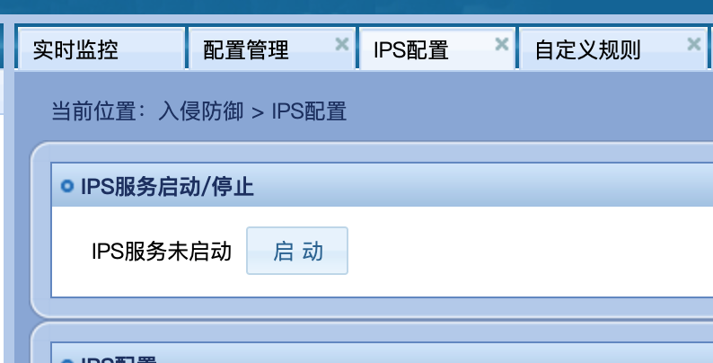
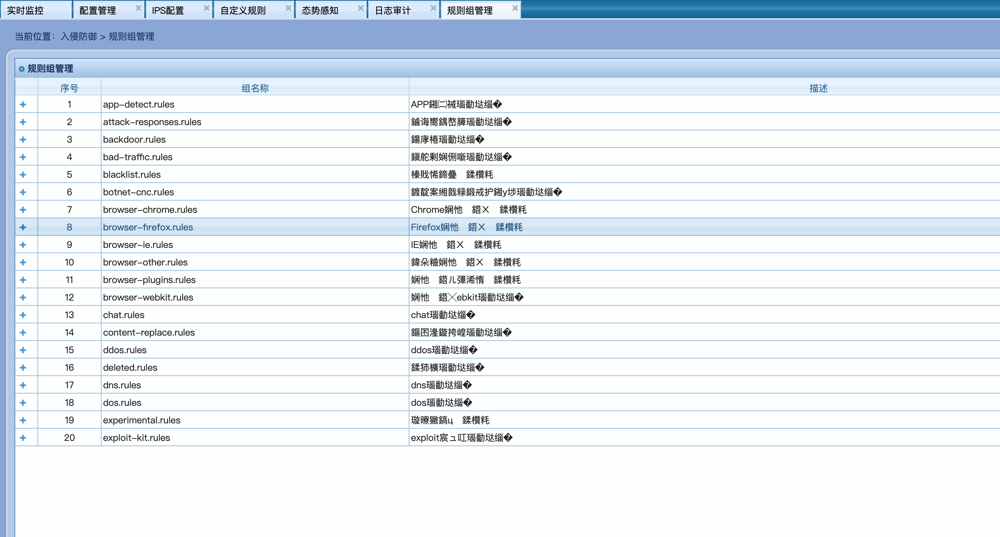
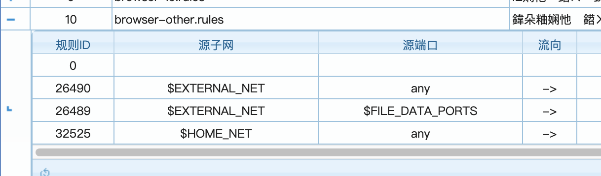
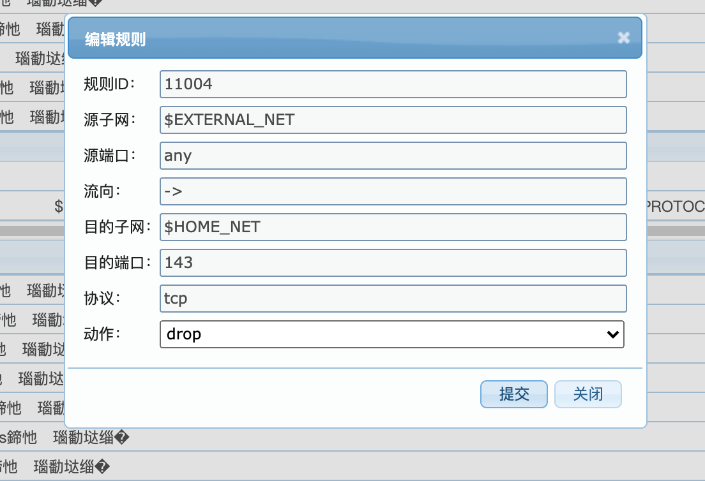
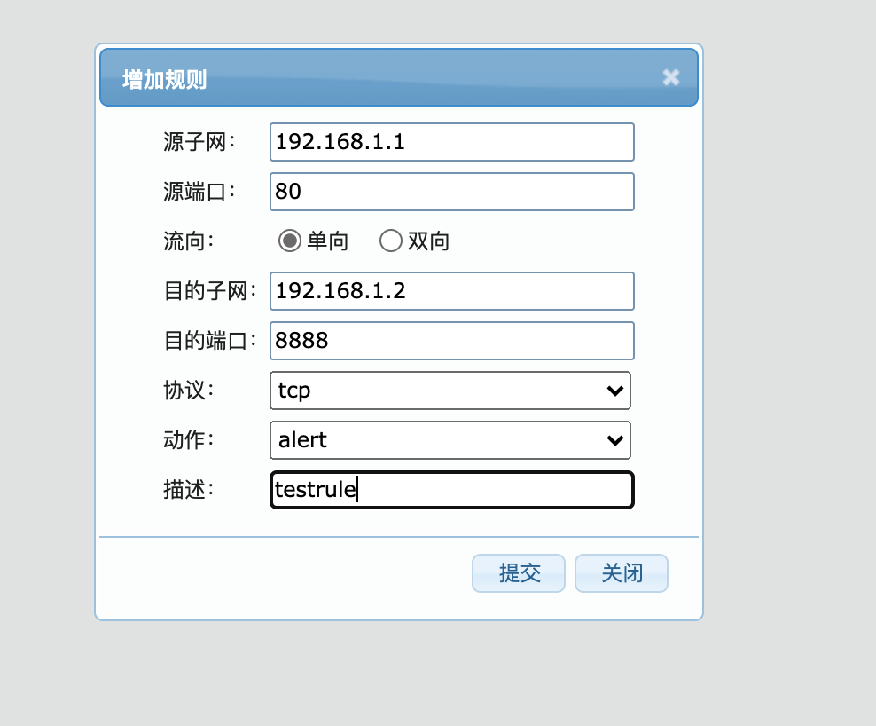
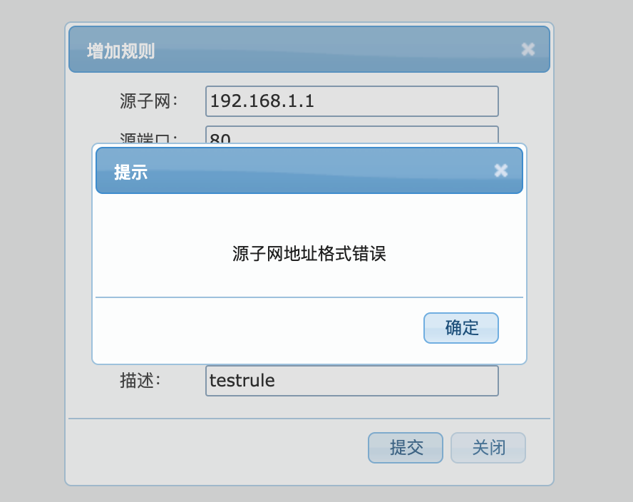

> 测试环境
>
> 服务器：Linux ips-test 4.19.90-17.5.ky10.aarch64 #1 SMP Fri Aug 7 13:35:33 CST 2020 aarch64 aarch64 aarch64 GNU/Linux
>
> 安装包：ips version 1.1.1

## 1 测试内容
### 1.1 安装
- [x] 脚本安装`./install install ips_1.1.1_aarch64.tar.gz`(安装完成需要在`suricata.yaml`中配置`af-packet`与`dpdk`的配置)

### 1.2 WEB
#### 1.2.1 IPS配置
- [ ] IPS服务启动**(待本地测试)**
- [x] 内网IP段修改
- [x] 多模匹配算法修改
- [x] 单模匹配算法修改
#### 1.2.2 规则组管理
- [ ] 所有规则集展示
- [ ] 规则集内所有规则展示
- [ ] 规则动作修改
#### 1.2.3 自定义规则
- [ ] 自定义规则添加
#### 1.2.4 日志审计
- [ ] 日志正常抓取
- [ ] 显示事件名称、事件发生日期和时间、源IP、源端口、目的IP、目的端口、危害等级等
#### 1.2.5 态势感知
- [ ] 按照攻击日志内容正常显示

### 1.3 Suricata测试
#### 1.3.1 功能测试
- [ ] 本地pcap测试`suricata -c /etc/suricata/suricata.yaml -r 1.pcap`
- [ ] 规则生效拦截报文
- [ ] 日志系统记录正常
#### 1.3.2 `--af-packet`模式测试**(待本地测试)**
- [ ] 配置后WEB界面启动
- [ ] 规则生效拦截报文
- [ ] 日志系统记录正常
#### 1.3.3 `--dpdk`模式测试**(待本地测试)**
- [ ] 配置后WEB界面启动
- [ ] 规则生效拦截报文
- [ ] 日志系统记录正常

## 2 存在问题
### 2.1 安装
安装完成后suricata没有启动*（不重要，但与install.sh不符）*
```bash
spawn-fcgi: child spawned successfully: PID: 6515
Install OK exit
[root@ips-test ~]# ps -x | grep suricata
   7810 pts/1    S+     0:00 grep suricata
[root@ips-test ~]# pidof suricata
[root@ips-test ~]# 
```



### 2.2 Web
#### 2.2.1 IPS配置
- IPS服务启动——网卡配置无法完成待测试
- 设计问题：是否要增添`--af-packet`与`--dpdk`选项设置，目前默认的方式是什么

#### 2.2.2 规则组管理
- 规则组管理-描述乱码

- 规则组展开-会有一个SID：0项

- 规则动作修改-点击提交没反应

#### 2.2.3 自定义规则
- 描述字段无法输入空格*（不重要）*

- 正常输入子网地址显示格式错误（并因此没有测试自定义规则添加）

- 设计问题：自定义添加规则描述字段对应msg，则自定义添加规则页面无添加实际检测内容规则的选项
#### 2.2.4 日志审计

#### 2.2.5 态势感知

### 2.3 Suricata测试
#### 2.3.1 功能测试
- suricata pcap测试启动失败
```bash
[root@ips-test ~]#
[root@ips-test ~]# suricata -c /etc/suricata/suricata.yaml -r 1.pcap
[9545] 31/8/2021 -- 13:24:37 - (suricata.c:1084) <Notice> (LogVersion) -- This is Suricata version 7.0.0-dev running in USER mode
Killed
[root@ips-test ~]#
```
- `suricata -c /etc/suricata/suricata.yaml -r 1.pcap`会在当前目录生成日志文件(不知道IPS启动下有没有该问题)
```bash
[root@ips-test ~]#
[root@ips-test ~]# ls
1.pcap  eve.json  fast.log  install.sh  ips_1.1.1_aarch64.tar.gz  ips.zip  stats.log  suricata.log
```