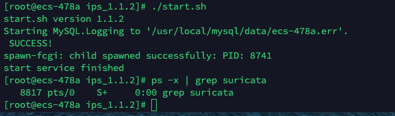

> 测试环境
>
> 服务器：Linux ips-test 4.19.90-17.5.ky10.aarch64 #1 SMP Fri Aug 7 13:35:33 CST 2020 aarch64 aarch64 aarch64 GNU/Linux
>
> 安装包：ips version 1.1.2

## 1 测试内容
### 1.1 安装
- [x] 脚本安装`./install install ips_1.1.1_aarch64.tar.gz`(安装完成需要在`suricata.yaml`中配置`af-packet`与`dpdk`的配置)

### 1.2 WEB
#### 1.2.1 IPS配置
- [ ] IPS服务启动**(待本地测试)**
- [x] 内网IP段修改
- [x] 多模匹配算法修改
- [x] 单模匹配算法修改
#### 1.2.2 规则组管理
- [x] 所有规则集展示
- [x] 规则集内所有规则展示
- [x] 规则动作修改
#### 1.2.3 自定义规则
- [ ] 自定义规则添加
#### 1.2.4 日志审计
- [x] 日志正常抓取
- [x] 显示事件名称、事件发生日期和时间、源IP、源端口、目的IP、目的端口、危害等级等
#### 1.2.5 态势感知
- [x] 按照攻击日志内容正常显示

### 1.3 Suricata测试
#### 1.3.1 功能测试
- [x] 本地pcap测试`suricata -c /etc/suricata/suricata.yaml -r 1.pcap`
- [x] 规则生效拦截报文
- [x] 日志系统记录正常
#### 1.3.2 `--af-packet`模式测试**(待本地测试)**
- [ ] 配置后WEB界面启动
- [ ] 规则生效拦截报文
- [ ] 日志系统记录正常
#### 1.3.3 `--dpdk`模式测试**(待本地测试)**
- [ ] 配置后WEB界面启动
- [ ] 规则生效拦截报文
- [ ] 日志系统记录正常

## 2 存在问题
### 2.1 安装
服务启动后显示无法停止（实际应该停止了），后台查看无suricata进程，刷新页面显示服务停止

### 2.2 Web
#### 2.2.1 IPS配置
#### 2.2.2 规则组管理
#### 2.2.3 自定义规则
- 描述字段无法输入空格*（不重要）*
- 无法添加自定义规则
#### 2.2.4 日志审计

#### 2.2.5 态势感知

### 2.3 Suricata测试
#### 2.3.1 功能测试
