> 在使用系统之前，应在配置文件中进行网口网卡配置。

## 系统安装

对于信创入侵防御系统，使用安装包ips_1.1.5_aarch64.zip使用如下命令进行安装：

```bash
unzip ips_1.1.5_aarch64.zip
chmod +x *.sh
./install.sh install ips_1.1.3_aarch64.tar.gz
```

等待系统安装成功即可进行系统配置。

系统配置完成后运行ips目录下的启动脚本启动系统：

```bash
./start.sh
```

## 系统配置

### 1. af-packet配置

使用默认IPS模式进行入侵防御，需在`/etc/suricata/suricata.yaml`中修改af-packet项目下的部分条目。IPS模式需要进行两个网口配置，分别负责了流量流入与流量流出。在本例中两张网口名表述为p1p2与p1p1（可用ifconfig查看）。

1. 将第一个interface配置为p1p2，且其下的copy-iface应配置为另一网口名，在此处即p1p1。同时将use-mmap选项设置为yes；

2. 同时将第二个interface配置为p1p1，且其下的copy-iface应配置为另一网口名，在此处即p1p2。同时将use-mmap选项设置为yes；

3. 第三个interface保持default不变。

经过上述操作配置完成，完成配置如下例所示（具体名称根据具体设备网口名称而变化）：

```yaml
# Linux high speed capture support
af-packet:
  - interface: p1p2
    # Number of receive threads. "auto" uses the number of cores
    threads: 2
    # Default clusterid. AF_PACKET will load balance packets based on flow.
    cluster-id: 99
    # Default AF_PACKET cluster type. AF_PACKET can load balance per flow or per hash.
    # This is only supported for Linux kernel > 3.1
    # possible value are:
    #  * cluster_flow: all packets of a given flow are sent to the same socket
    #  * cluster_cpu: all packets treated in kernel by a CPU are sent to the same socket
    #  * cluster_qm: all packets linked by network card to a RSS queue are sent to the same
    #  socket. Requires at least Linux 3.14.
    #  * cluster_ebpf: eBPF file load balancing. See doc/userguide/capture-hardware/ebpf-xdp.rst for
    #  more info.
    # Recommended modes are cluster_flow on most boxes and cluster_cpu or cluster_qm on system
    # with capture card using RSS (requires cpu affinity tuning and system IRQ tuning)
    cluster-type: cluster_flow
    # In some fragmentation cases, the hash can not be computed. If "defrag" is set
    # to yes, the kernel will do the needed defragmentation before sending the packets.
    defrag: no
    # To use the ring feature of AF_PACKET, set 'use-mmap' to yes
    use-mmap: yes
    # Lock memory map to avoid it being swapped. Be careful that over
    # subscribing could lock your system
    #mmap-locked: yes
    # Use tpacket_v3 capture mode, only active if use-mmap is true
    # Don't use it in IPS or TAP mode as it causes severe latency
    #tpacket-v3: yes
    # Ring size will be computed with respect to "max-pending-packets" and number
    # of threads. You can set manually the ring size in number of packets by setting
    # the following value. If you are using flow "cluster-type" and have really network
    # intensive single-flow you may want to set the "ring-size" independently of the number
    # of threads:
    #ring-size: 2048
    # Block size is used by tpacket_v3 only. It should set to a value high enough to contain
    # a decent number of packets. Size is in bytes so please consider your MTU. It should be
    # a power of 2 and it must be multiple of page size (usually 4096).
    #block-size: 32768
    # tpacket_v3 block timeout: an open block is passed to userspace if it is not
    # filled after block-timeout milliseconds.
    #block-timeout: 10
    # On busy systems, set it to yes to help recover from a packet drop
    # phase. This will result in some packets (at max a ring flush) not being inspected.
    #use-emergency-flush: yes
    # recv buffer size, increased value could improve performance
    buffer-size: 32768
    # Set to yes to disable promiscuous mode
    # disable-promisc: no
    # Choose checksum verification mode for the interface. At the moment
    # of the capture, some packets may have an invalid checksum due to
    # the checksum computation being offloaded to the network card.
    # Possible values are:
    #  - kernel: use indication sent by kernel for each packet (default)
    #  - yes: checksum validation is forced
    #  - no: checksum validation is disabled
    #  - auto: Suricata uses a statistical approach to detect when
    #  checksum off-loading is used.
    # Warning: 'capture.checksum-validation' must be set to yes to have any validation
    #checksum-checks: kernel
    # BPF filter to apply to this interface. The pcap filter syntax applies here.
    #bpf-filter: port 80 or udp
    # You can use the following variables to activate AF_PACKET tap or IPS mode.
    # If copy-mode is set to ips or tap, the traffic coming to the current
    # interface will be copied to the copy-iface interface. If 'tap' is set, the
    # copy is complete. If 'ips' is set, the packet matching a 'drop' action
    # will not be copied.
    copy-mode: ips
    copy-iface: p1p1
    #  For eBPF and XDP setup including bypass, filter and load balancing, please
    #  see doc/userguide/capture-hardware/ebpf-xdp.rst for more info.

  - interface: p1p1
    # Number of receive threads. "auto" uses the number of cores
    threads: 2
    # Default clusterid. AF_PACKET will load balance packets based on flow.
    cluster-id: 98
    # Default AF_PACKET cluster type. AF_PACKET can load balance per flow or per hash.
    # This is only supported for Linux kernel > 3.1
    # possible value are:
    #  * cluster_flow: all packets of a given flow are sent to the same socket
    #  * cluster_cpu: all packets treated in kernel by a CPU are sent to the same socket
    #  * cluster_qm: all packets linked by network card to a RSS queue are sent to the same
    #  socket. Requires at least Linux 3.14.
    #  * cluster_ebpf: eBPF file load balancing. See doc/userguide/capture-hardware/ebpf-xdp.rst for
    #  more info.
    # Recommended modes are cluster_flow on most boxes and cluster_cpu or cluster_qm on system
    # with capture card using RSS (requires cpu affinity tuning and system IRQ tuning)
    cluster-type: cluster_flow
    # In some fragmentation cases, the hash can not be computed. If "defrag" is set
    # to yes, the kernel will do the needed defragmentation before sending the packets.
    defrag: no
    # To use the ring feature of AF_PACKET, set 'use-mmap' to yes
    use-mmap: yes
    # Lock memory map to avoid it being swapped. Be careful that over
    # subscribing could lock your system
    #mmap-locked: yes
    # Use tpacket_v3 capture mode, only active if use-mmap is true
    # Don't use it in IPS or TAP mode as it causes severe latency
    #tpacket-v3: yes
    # Ring size will be computed with respect to "max-pending-packets" and number
    # of threads. You can set manually the ring size in number of packets by setting
    # the following value. If you are using flow "cluster-type" and have really network
    # intensive single-flow you may want to set the "ring-size" independently of the number
    # of threads:
    #ring-size: 2048
    # Block size is used by tpacket_v3 only. It should set to a value high enough to contain
    # a decent number of packets. Size is in bytes so please consider your MTU. It should be
    # a power of 2 and it must be multiple of page size (usually 4096).
    #block-size: 32768
    # tpacket_v3 block timeout: an open block is passed to userspace if it is not
    # filled after block-timeout milliseconds.
    #block-timeout: 10
    # On busy systems, set it to yes to help recover from a packet drop
    # phase. This will result in some packets (at max a ring flush) not being inspected.
    #use-emergency-flush: yes
    # recv buffer size, increased value could improve performance
    buffer-size: 32768
    # Set to yes to disable promiscuous mode
    # disable-promisc: no
    # Choose checksum verification mode for the interface. At the moment
    # of the capture, some packets may have an invalid checksum due to
    # the checksum computation being offloaded to the network card.
    # Possible values are:
    #  - kernel: use indication sent by kernel for each packet (default)
    #  - yes: checksum validation is forced
    #  - no: checksum validation is disabled
    #  - auto: Suricata uses a statistical approach to detect when
    #  checksum off-loading is used.
    # Warning: 'capture.checksum-validation' must be set to yes to have any validation
    #checksum-checks: kernel
    # BPF filter to apply to this interface. The pcap filter syntax applies here.
    #bpf-filter: port 80 or udp
    # You can use the following variables to activate AF_PACKET tap or IPS mode.
    # If copy-mode is set to ips or tap, the traffic coming to the current
    # interface will be copied to the copy-iface interface. If 'tap' is set, the
    # copy is complete. If 'ips' is set, the packet matching a 'drop' action
    # will not be copied.
    copy-mode: ips
    copy-iface: p1p2

  # Put default values here. These will be used for an interface that is not
  # in the list above.
  - interface: default
    #threads: auto
    #use-mmap: no
    #tpacket-v3: yes
```

### 2. dpdk配置

使用DPDK模式进行入侵防御，需在`/etc/suricata/suricata.yaml`中修改dpdk项目下的部分条目。DPDK模式需要进行两个网口PCIe地址配置，分别负责了流量流入与流量流出。在本例中两张网口表述为0000:01:00.0与0000:01:00.1。

1. 将第一个interface配置为0000:01:00.0，且其下的copy-iface应配置为另一网口PCIe地址，在此处即0000:01:00.1；

2. 同时将第二个interface配置为0000:01:00.1，且其下的copy-iface应配置为另一网口PCIe地址，在此处即0000:01:00.0；

3. 第三个interface保持default不变。

经过上述操作配置完成，完成配置如下例所示（具体名称根据具体设备网口PCIe地址而变化）。

```yaml
dpdk:
  eal-params:
    proc-type: primary
    l: 0-7

  # DPDK capture support
  # Currently queues should be assigned to cores in ratio in 1:1 ratio
  interfaces:
    - interface: 0000:01:00.1  # PCIe address of the NIC port
      # Threading: possible values are either "auto" or number of threads
      # - auto takes all lcores
      # in IPS mode it is required to specify the number of cores and the numbers on both interfaces must match
      threads: 2
      promisc: true
      multicast: true # enables also detection on multicast packets
      checksum-checks: true # if Suricata should validate checksums
      checksum-checks-offload: true # if possible offload checksum validation to the NIC
      mtu: 3000 # Set MTU of the device in bytes # default 1526
      #
      # start of per queue settings
      # to approximately calculate required amount of space (in bytes) for mempool: nb_threads * mempool-size * mtu

      # The optimum size (in terms of memory usage) is power of two minus one: n = (2^q - 1)
      mempool-size: 262143 # The number of elements in the mbuf pool
      #
      # Must be lower or equal to RTE_MEMPOOL_CACHE_MAX_SIZE (by default 512) and "mempool-size / 1.5"
      # It is advised to choose cache_size to have "mempool-size modulo cache_size == 0".
      # If this is not the case, some elements will always stay in the pool and will never be used.
      # The cache can be disabled if the cache_size argument is set to 0, can be useful to avoid losing objects in cache
      mempool-cache-size: 511
      rx-descriptors: 1024
      tx-descriptors: 1024
      # end of per queue settings
      #
      # IPS mode for Suricata works in 3 modes - none, tap, ips
      # - none: IDS mode only - disables IPS functionality (does not further forward packets)
      # - tap: forwards all packets and generates alerts (omits DROP action)
      # - ips: the same as tap mode but it also drops packets that are flagged by rules to be dropped
      copy-mode: ips
      copy-iface: 0000:01:00.0 # or PCIe address of the second interface

    - interface: 0000:01:00.0  # PCIe address of the NIC port
      # Threading: possible values are either "auto" or number of threads
      # - auto takes all lcores
      # in IPS mode it is required to specify the number of cores and the numbers on both interfaces must match
      threads: 2
      promisc: true
      multicast: true # enables also detection on multicast packets
      checksum-checks: true # if Suricata should validate checksums
      checksum-checks-offload: true # if possible offload checksum validation to the NIC
      mtu: 3000 # Set MTU of the device in bytes # default 1526
      #
      # start of per queue settings
      # to approximately calculate required amount of space (in bytes) for mempool: nb_threads * mempool-size * mtu

      # The optimum size (in terms of memory usage) is power of two minus one: n = (2^q - 1)
      mempool-size: 262143 # The number of elements in the mbuf pool
      #
      # Must be lower or equal to RTE_MEMPOOL_CACHE_MAX_SIZE (by default 512) and "mempool-size / 1.5"
      # It is advised to choose cache_size to have "mempool-size modulo cache_size == 0".
      # If this is not the case, some elements will always stay in the pool and will never be used.
      # The cache can be disabled if the cache_size argument is set to 0, can be useful to avoid losing objects in cache
      mempool-cache-size: 511
      rx-descriptors: 1024
      tx-descriptors: 1024
      # end of per queue settings
      #
      # IPS mode for Suricata works in 3 modes - none, tap, ips
      # - none: IDS mode only - disables IPS functionality (does not further forward packets)
      # - tap: forwards all packets and generates alerts (omits DROP action)
      # - ips: the same as tap mode but it also drops packets that are flagged by rules to be dropped
      copy-mode: ips
      copy-iface: 0000:01:00.1 # or PCIe address of the second interface


    - interface: default
      threads: auto # or number of threads - auto takes all lcores, no thread entry takes all cores
      rx-queues: auto # or number of queues - auto assigns each core 1 queue
      tx-queues: auto # or number of queues - auto assigns each core 1 queue
      promisc: true
      multicast: true # enables also detection on multicast packets
      checksum-checks: true # if Suricata should validate checksums
      checksum-checks-offload: true # if possible offload checksum validation to the NIC
      mtu: 3000 # Set MTU of the device in bytes # default 1526
      mempool-size: 65356 # 64*1024
      mempool-cache-size: 250
      rx-descriptors: 1024
      tx-descriptors: 1024
      # IPS mode for Suricata works in 3 modes - none, tap, ips
      # - none: disables IPS functionality (does not further forward packets)
      # - tap: forwards all packets and generates alerts (omits DROP action)
      # - ips: the same as tap mode but it also drops packets that are flagged by rules to be dropped
      copy-mode: none
      copy-iface: none
```

## 系统使用

### 1. IPS配置

#### 1.1 IPS配置主界面

在IPS配置界面可以进行服务的启停与IPS配置。主界面内容如下：

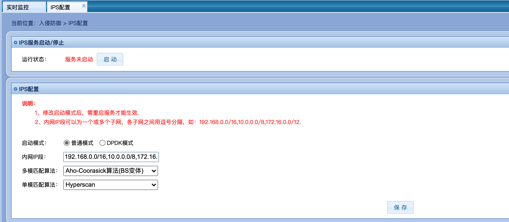

#### 1.2 IPS服务启动/停止

运行状态即显示现在IPS服务的运行状态。

点击启动/停止按钮即可启动/停止IPS服务。

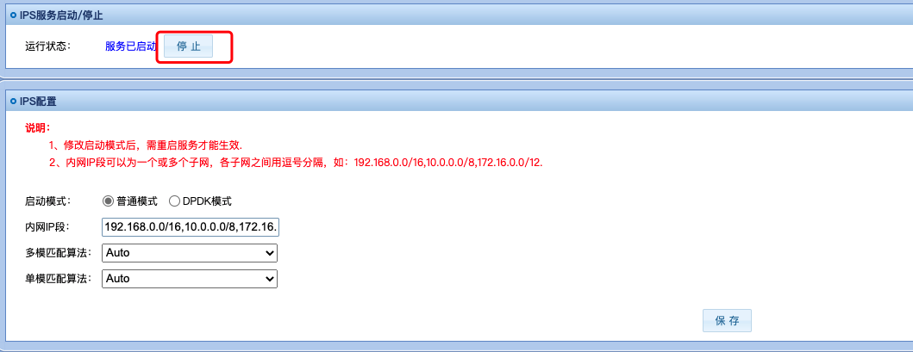

#### 1.3 IPS配置修改

##### 1.3.1 启动模式

启动模式即选择IPS服务以普通模式或以DPDK模式运行。

普通模式即基于af-packet的IPS服务，DPDK模式即基于DPDK模式的IPS服务。

选择完成后点击下方的“保存”按钮保存修改。

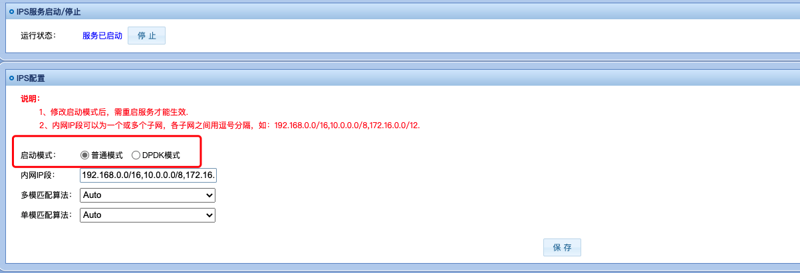

同时需要重新启动IPS服务使IPS服务按照选定方式运行。

##### 1.3.2 内网IP段

内网IP段即指定内网网段，在部分检测规则中存在仅针对外网IP进行检测，以此提升检测速度。

内网IP段使用子网掩码形式表示，若存在多个子网，各子网之间用逗号分隔，示例如下：

```
192.168.0.0/16,10.0.0.0/8
```

选择完成后点击下方的“保存”按钮保存修改。

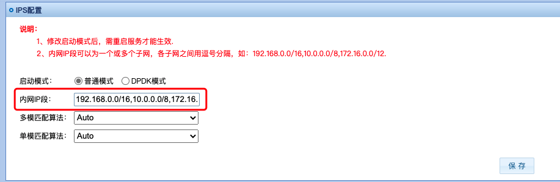

同时需要重新启动IPS服务使IPS服务按照选定方式运行。

##### 1.3.3 多模匹配算法

多模匹配算法即指定多模匹配算法，用以提升检测效率。

可以选择指定，auto（默认）、Hyperscan、Aho-Corasick算法、Aho-Corasick算法（BS变体）、Aho-Corasick算法（KS变体）。

选择完成后点击下方的“保存”按钮保存修改。

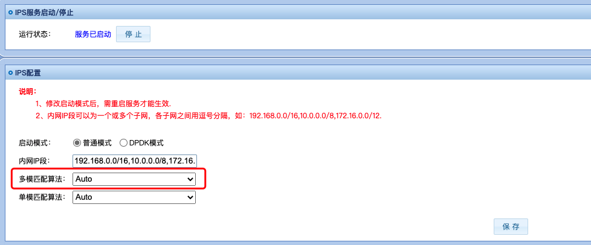

同时需要重新启动IPS服务使IPS服务按照选定方式运行。

##### 1.3.4 单模匹配算法

多模匹配算法即指定多模匹配算法，用以提升检测效率。

可以选择指定，auto（默认）、Hyperscan、Boyer-Moore算法。

选择完成后点击下方的“保存”按钮保存修改。


同时需要重新启动IPS服务使IPS服务按照选定方式运行。


### 2. 规则集管理

#### 2.1 规则集管理主界面

在规则集管理界面可以进行规则组查看、规则集启用、规则集导入、规则查看与规则动作修改。主界面内容如下： 


#### 2.2 规则组查看

可在规则集管理主界面依次看到展开按钮、序号、组名称、描述与启用状态。

#### 2.3 规则组启用

可在下图所示，规则集右侧按钮处选定规则是否启用。


选定后点击右上角“应用”按钮应用选定规则集。


#### 2.4 规则集导入

可在右上角点击“导入规则”按钮进行规则集导入。


点击后，选择要上传的规则集文件（.rules后缀），填入描述后点击提交即可。

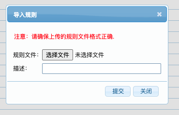

#### 2.5 规则查看

可点击规则集前的展开按钮“+”，对规则集进行展开，查看规则集下的规则信息，包括：规则ID、源子网、源端口、流向、目的子网、目的端口、协议、动作、描述、操作。

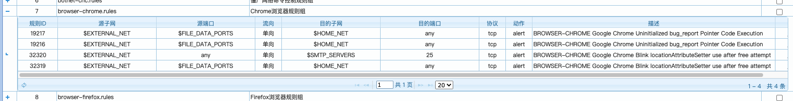

#### 2.6 规则动作修改

可在规则查看界面点击操作下的“编辑”按钮，进行规则的动作修改。


点击后，选择要上传动作，点击提交即可。

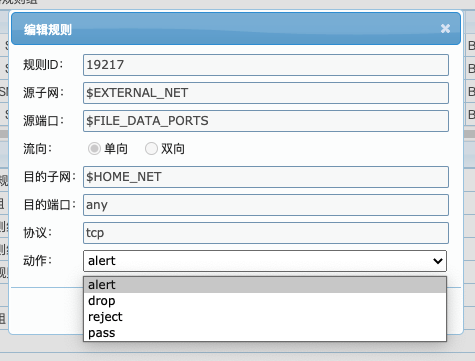

### 3. 自定义规则

3.1 自定义规则主界面

在自定义规则界面可以进行自定义规则查看、自定义规则添加、自定义规则删除与自定义规则编辑。主界面内容如下： 

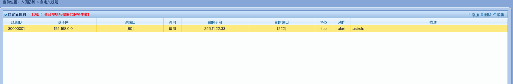

3.2 自定义规则查看

可在自定义规则主界面依次看到规则ID、源子网、源端口、流向、目的子网、目的端口、协议、动作、描述。

3.2 自定义规则添加

可在右上角点击“添加”按钮进行自定义规则添加。

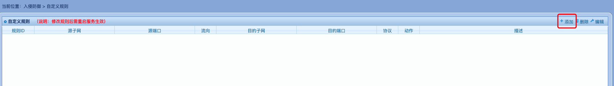

点击后，按照说明填入规则信息后，点击提交即可完成添加。

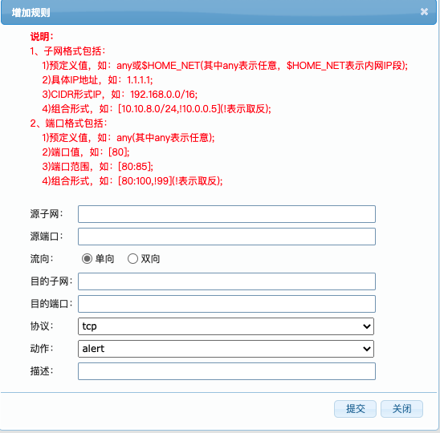

3.3 自定义规则删除

可在选中待操作规则条目后，右上角点击“删除”按钮进行自定义规则删除。

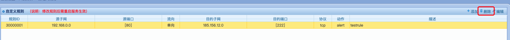


3.4 自定义规则编辑

可在选中待操作规则条目后，右上角点击“编辑”按钮进行自定义规则编辑。

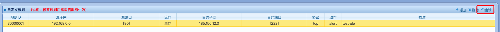

除规则ID生成后唯一且固定不能修改外，其他字段可按照说明及需求进行对应修改，点击提交即可完成编辑。

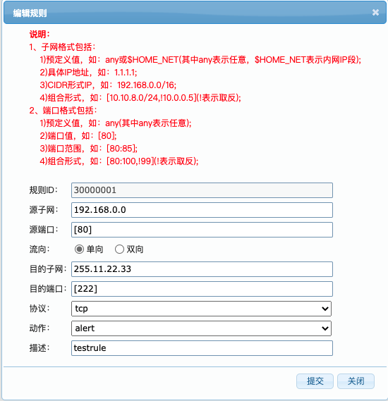