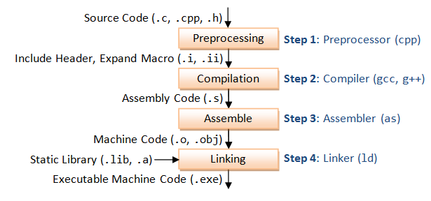

## 编译 Compile

将源文件编译成目标文件需要使用`-c`选项，例如：
```bash
gcc -c main.c
```
就将 main.c 编译为 main.o。打开 demo 目录，就会看到 main.o。

一个源文件会生成一个目标文件，多个源文件会生成多个目标文件，源文件数目和目标文件数目是一样的。通常情况下，默认的目标文件名字和源文件名字是一样的。

如果希望自定义目标文件的名字，那么可以使用`-o`选项，例如：
```bash
gcc -c main.c -o a.o
```
这样生成的目标文件的名字就是 a.o。

## 链接 Link
在`gcc`命令后面紧跟目标文件的名字，就可以将目标文件链接成为可执行文件，例如：
```bash
gcc main.o
```
就将 main.o 链接为 a.out。打开 demo 目录，就会看到 a.out。  

**在`gcc`命令后面紧跟源文件名字或者目标文件名字都是可以的，`gcc`命令能够自动识别到底是源文件还是目标文件：如果是源文件，那么要经过编译和链接两个步骤才能生成可执行文件；如果是目标文件，只需要链接就可以了。 **

使用`-o`选项仍然能够自定义可执行文件的名字，例如：
```bash
gcc main.o -o main.out
```
这样生成的可执行文件的名字就是 main.out。

## 参数
- `-c`：只产生编译代码
- `-o`：指定输出文件（无 Link）
- `-Wall`：启用所有警告
```c
#include<stdio.h>
int main(void)
{
   int i;
   printf("\n The Geek Stuff [%d]\n", i);
   return 0;
}
```
上面的代码编译时，会出现`未初始化的i`类似的警告。
```bash
$ gcc -Wall main.c -o main
main.c: In function ‘main’:
main.c:6:10: warning: ‘i’ is used uninitialized in this function [-Wuninitialized]
```
- `-save-temps`：产生所有的中间步骤的文件
```bash
$ gcc -save-temps main.c
$ ls
a.out   main.bc main.c  main.i  main.o  main.s
```
- `-llibname`：链接共享库件（如-lCPPfile）
- `-I`：指定头文件的文件夹
- `-L`：指定库文件的文件夹
> 上述三者看起来比较接近，参考下面的例子：
> ```bash
> gcc -o main mian.c -I /home/hello/include -L /home/hello/lib -lworld
> ```
> 上面这句表示在编译·hello.c时：
> `-I /home/hello/include`表示将/home/hello/include目录作为第一个寻找头文件的目录，寻找的顺序是：/home/hello/include-->/usr/include-->/usr/local/include 
> `-L /home/hello/lib`表示将/home/hello/lib目录作为第一个寻找库文件的目录，寻找的顺序是：/home/hello/lib-->/lib-->/usr/lib-->/usr/local/lib
> `-lworld`表示在上面的lib的路径中寻找libworld.so动态库文件（如果gcc编译选项中加入了“-static”表示寻找libworld.a静态库文件），程序链接的库名是world
- `-V`：指定库文件的文件夹
- `-D`：可以使用编译时的宏
```c
#include<stdio.h>
int main(void)
{
#ifdef MY_MACRO
  printf("\n Macro defined \n");
#endif
  char c = -10;
  // Print the string
   printf("\n The Geek Stuff [%d]\n", c);
   return 0;
}
```
`-D`可以用作从命令行定义宏`MY_MACRO`。
```bash
$ gcc -Wall -DMY_MACRO main.c -o main
$ ./main
 Macro defined 
 The Geek Stuff [-10]
```
- `-static`：生成静态链接的文件
静态编译文件(把动态库的函数和其它依赖都编译进最终文件)
```bash
gcc main.c -static -o main -lpthread
```
相反的使用`-shared`使用动态库链接。
- `-M`：生成文件关联的信息
```bash
$ gcc -M main.c
main.o: main.c \
  /Library/Developer/CommandLineTools/SDKs/MacOSX.sdk/usr/include/stdio.h \
  /Library/Developer/CommandLineTools/SDKs/MacOSX.sdk/usr/include/_stdio.h \
  /Library/Developer/CommandLineTools/SDKs/MacOSX.sdk/usr/include/sys/cdefs.h \
  /Library/Developer/CommandLineTools/SDKs/MacOSX.sdk/usr/include/sys/_symbol_aliasing.h \
...
```

---
> 参考：
> http://c.biancheng.net/view/661.html
> https://colobu.com/2018/08/28/15-Most-Frequently-Used-GCC-Compiler-Command-Line-Options/#%E6%8C%87%E5%AE%9A%E7%BC%96%E8%AF%91%E8%BE%93%E5%87%BA%E7%9A%84%E5%90%8D%E5%AD%97
> https://blog.csdn.net/weixin_37569048/article/details/81666879
