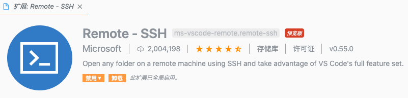
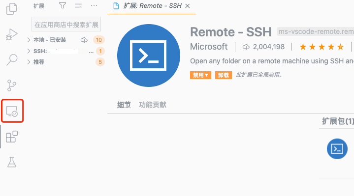

> 记录一下Linux的SSH免密配置，以及在VSCode上配置SSH以映射文件，编辑远端文档。

## SSH公私钥配置

> SSH使用方便且安全，公私钥均有本地生成，公钥存放至服务器端即可

### 生成密钥`ssh-keygen`

样例：

```bash
ssh-keygen -t rsa -f aliyun_ssh -C "备注"
```

| 参数 | 使用                                    |
| ---- | :-------------------------------------- |
| -f   | 生成文件名                              |
| -t   | 采用rsa加密方式,t=type                  |
| -b   | 采用长度1024bit的密钥对,b=bits,最长4096 |
| -C   | 备注                                    |

如果该命令是在`~/.ssh`目录下执行，执行后~/.ssh目录对多出`aliyun_ssh`和`aliyun_ssh.pub`两个文件。

有pub后缀的文件为公钥，没有pub后缀的文件为私钥。

### 配置公钥`ssh-copy-id`

样例：

```bash
ssh-copy-id -i ~/.ssh/aliyun_ssh.pub root@2.2.2.2
```

`-i` (identity_file认证文件)，其实是通过ssh将公钥写入远程服务器的`~/ .ssh/authorized_key`中（向后添加）。通过文本的复制效果相同。

> 注：**需要服务器端的~/ .ssh/authorized_key文件具有600权限！**

### 本地SSH配置

配置格式简单如下：

```json
Host 10.211.1.1
  HostName 10.211.1.1
  User root

Host aliyun-2.2.2.2
  HostName 2.2.2.2
  User root
  IdentityFile ~/.ssh/aliyun_ssh
```

其中**Host**是自己备注的名字，**HostName**即服务器IP，**User**为登录用户。

如果使用SSH公私钥登录则需要配置**IdentityFile**指向本地存放的私钥。

登录时即可备注的名字快速登录(支持tab补全)

```bash
ssh aliyun-2.2.2.2
```


## 配置VSCode Remote - SSH

直接在VSCode安装Remote - SSH扩展即可。



安装完后会在侧边栏和左下角出现相应的扩展栏。



可根据系统ssh-config进行连接，即可快速在本地编辑远端文本。


## VSCode快捷键

> 最后记录一些常用的快捷键

### 全局

```bash
Command + Shift + P / F1 显示命令面板
Command + P 快速打开
Command + Shift + N 打开新窗口
Command + W 关闭窗口
```

### 基本

```bash
Command + X 剪切（未选中文本的情况下，剪切光标所在行）
Command + C 复制（未选中文本的情况下，复制光标所在行）
Option + Up 向上移动行
Option + Down 向下移动行
Option + Shift + Up 向上复制行
Option + Shift + Down 向下复制行
Command + Shift + K 删除行
Command + Enter 下一行插入
Command + Shift + Enter 上一行插入
Command + Shift + \ 跳转到匹配的括号
Command + [ 减少缩进
Command + ] 增加缩进
Home 跳转至行首
End 跳转到行尾
Command + Up 跳转至文件开头
Command + Down 跳转至文件结尾
Ctrl + PgUp 按行向上滚动
Ctrl + PgDown 按行向下滚动
Command + PgUp 按屏向上滚动
Command + PgDown 按屏向下滚动
Command + Shift + [ 折叠代码块
Command + Shift + ] 展开代码块
Command + K Command + [ 折叠全部子代码块
Command + K Command + ] 展开全部子代码块
Command + K Command + 0 折叠全部代码块
Command + K Command + J 展开全部代码块
Command + K Command + C 添加行注释
Command + K Command + U 移除行注释
Command + / 添加、移除行注释
Option + Shift + A 添加、移除块注释
Option + Z 自动换行、取消自动换行
```

### 多光标与选择

```bash
Option + 点击 插入多个光标
Command + Option + Up 向上插入光标
Command + Option + Down 向下插入光标
Command + U 撤销上一个光标操作
Option + Shift + I 在所选行的行尾插入光标
Command + I 选中当前行
Command + Shift + L 选中所有与当前选中内容相同部分
Command + F2 选中所有与当前选中单词相同的单词
Command + Ctrl + Shift + Left 折叠选中
Command + Ctrl + Shift + Right 展开选中
Alt + Shift + 拖动鼠标 选中代码块
Command + Shift + Option + Up 列选择 向上
Command + Shift + Option + Down 列选择 向下
Command + Shift + Option + Left 列选择 向左
Command + Shift + Option + Right 列选择 向右
Command + Shift + Option + PgUp 列选择 向上翻页
Command + Shift + Option + PgDown 列选择 向下翻页
```

### 查找替换

```bash
Command + F 查找
Command + Option + F 替换
Command + G 查找下一个
Command + Shift + G 查找上一个
Option + Enter 选中所有匹配项
Command + D 向下选中相同内容
Command + K Command + D 移除前一个向下选中相同内容
```

### 进阶

```bash
Ctrl + Space 打开建议
Command + Shift + Space 参数提示
Tab Emmet插件缩写补全
Option + Shift + F 格式化
Command + K Command + F 格式化选中内容
F12 跳转到声明位置
Option + F12 查看具体声明内容
Command + K F12 分屏查看具体声明内容
Command + . 快速修复
Shift + F12 显示引用
F2 重命名符号
Command + Shift + . 替换为上一个值
Command + Shift + , 替换为下一个值
Command + K Command + X 删除行尾多余空格
Command + K M 更改文件语言
```

### 导航

```bash
Command + T 显示所有符号
Ctrl + G 跳转至某行
Command + P 跳转到某个文件
Command + Shift + O 跳转到某个符号
Command + Shift + M 打开问题面板
F8 下一个错误或警告位置
Shift + F8 上一个错误或警告位置
Ctrl + Shift + Tab 编辑器历史记录
Ctrl + - 后退
Ctrl + Shift + - 前进
Ctrl + Shift + M Tab 切换焦点
```

### 编辑器管理

```bash
Command + W 关闭编辑器
Command + K F 关闭文件夹
Command + \ 编辑器分屏
Command + 1 切换到第一分组
Command + 2 切换到第二分组
Command + 3 切换到第三分组
Command + K Command + Left 切换到上一分组
Command + K Command + Right 切换到下一分组
Command + K Command + Shift + Left 左移编辑器
Command + K Command + Shift + Right 右移编辑器
Command + K Left 激活左侧编辑组
Command + K Right 激活右侧编辑组
```

### 文件管理

```bash
Command + N 新建文件
Command + O 打开文件
Command + S 保存文件
Command + Shift + S 另存为
Command + Option + S 全部保存
Command + W 关闭
Command + K Command + W 全部关闭
Command + Shift + T 重新打开被关闭的编辑器
Command + K Enter 保持打开
Ctrl + Tab 打开下一个
Ctrl + Shift + Tab 打开上一个
Command + K P 复制当前文件路径
Command + K R 在资源管理器中查看当前文件
Command + K O 新窗口打开当前文件
```

### 显示

```bash
Command + Ctrl + F 全屏、退出全屏
Command + Option + 1 切换编辑器分屏方式（横、竖）
Command + + 放大
Command + - 缩小
Command + B 显示、隐藏侧边栏
Command + Shift + E 显示资源管理器 或 切换焦点
Command + Shift + F 显示搜索框
Ctrl + Shift + G 显示Git面板
Command + Shift + D 显示调试面板
Command + Shift + X 显示插件面板
Command + Shift + H 全局搜索替换
Command + Shift + J 显示、隐藏高级搜索
Command + Shift + C 打开新终端
Command + Shift + U 显示输出面板
Command + Shift + V Markdown预览窗口
Command + K V 分屏显示 Markdown预览窗口
```

### 调试

```bash
F9 设置 或 取消断点
F5 开始 或 继续
F11 进入
Shift + F11 跳出
F10 跳过
Command + K Command + I 显示悬停信息
```

### 集成终端

```bash
Ctrl + ` 显示终端
Ctrl + Shift + ` 新建终端
Command + Up 向上滚动
Command + Down 向下滚动
PgUp 向上翻页
PgDown 向下翻页
Command + Home 滚动到顶部
Command + End 滚动到底部
```

---

> 参考：
>
> https://www.jianshu.com/p/dd053c18e5ee
>
> https://segmentfault.com/a/1190000012811886