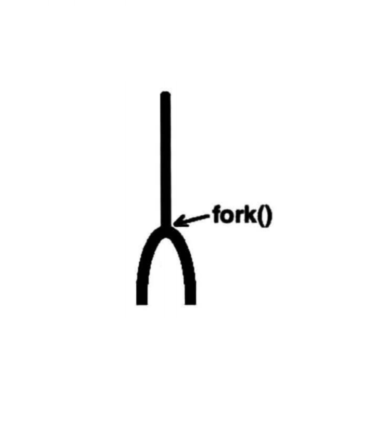
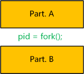

## 1. 前导

1. 进程可以看做程序的一次执行过程。在linux下，每个进程有唯一的PID标识进程。PID是一个从1到32768的正整数，其中1一般是特殊进程init，其它进程从2开始依次编号。当用完32768后，从2重新开始。

2. linux中有一个叫进程表的结构用来存储当前正在运行的进程。可以使用`ps aux`命令查看所有正在运行的进程。

3. 进程在linux中呈树状结构，init为根节点，其它进程均有父进程，某进程的父进程就是启动这个进程的进程，这个进程叫做父进程的子进程。

4. fork的作用是**复制一个与当前进程一样的进程**。新进程的所有数据（变量、环境变量、程序计数器等）数值都和原进程一致，但是是一个全新的进程，并作为原进程的子进程。

### fork函数

- 该进程为父进程时，返回子进程的pid
- 该进程为子进程时，返回0
- fork执行失败，返回-1

其实根据名字十分形象，fork叉子分叉：



## 2. 例题

在网上看fork机制[文章](https://www.jianshu.com/p/1327c51a4a99)中发现一道不错帮助理解的例题，特此记录。

```c
/* 
已知从这个程序执行到这个程序的所有进程结束这个时间段内，没有其它新进程执行。
1、请说出执行这个程序后，将一共运行几个进程。
2、如果其中一个进程的输出结果是“pid1:1001, pid2:1002”，写出其他进程的输出结果（不考虑进程执行顺序）。
*/

int mian(){
	pid_t pid1;
	pid_t pid2;
	
	pid1 = fork();
	pid2 = fork();
	
	printf("pid1:%d,pid2:%d\n",pid1,pid2);
}
```

### 2.1 解题关键

解题的关键就是要认识到fork将程序切成两段。看下图：



 上图表示一个含有fork的程序，而fork语句可以看成将程序切为A、B两个部分。然后整个程序会如下运行：

1. 设由shell直接执行程序，生成了进程P。P执行完Part. A的所有代码。
2. 当执行到`pid = fork();`时，P启动一个进程Q，Q是P的子进程，和P是同一个程序的进程。Q继承P的所有变量、环境变量、程序计数器的当前值。
3. 在P进程中，fork()**将Q的PID返回给变量pid**，并继续执行Part. B的代码。
4. 在进程Q中，**将0赋给pid**，并继续执行Part. B的代码。

这里有三个点非常关键:

1. P执行了所有程序，而Q只执行了Part. B，即fork()后面的程序。（这是因为Q继承了P的PC-程序计数器）
2. Q继承了fork()语句执行时当前的环境，而不是程序的初始环境。
3. P中fork()语句启动子进程Q，并将Q的PID返回，而Q中的fork()语句不启动新进程，仅将0返回。

### 2.2 解题过程

下面利用上文阐述的知识进行解题。这里我把两个问题放在一起进行分析。

1. 从shell中执行此程序，启动了一个进程，我们设这个进程为P0，设其PID为XXX（解题过程不需知道其PID）。

2. 当执行到pid1 = fork();时，P0启动一个子进程P1，由题目知P1的PID为1001。我们暂且不管P1。

3. P0中的fork返回1001给pid1，继续执行到pid2 = fork();，此时启动另一个新进程，设为P2，由题目知P2的PID为1002。同样暂且不管P2。
4. P0中的第二个fork返回1002给pid2，继续执行完后续程序，结束。所以，P0的结果为“pid1:1001, pid2:1002”。
5. 再看P2，P2生成时，P0中pid1=1001，所以P2中pid1继承P0的1001，而作为子进程pid2=0。P2从第二个fork后开始执行，结束后输出“pid1:1001, pid2:0”。
6. 接着看P1，P1中第一条fork返回0给pid1，然后接着执行后面的语句。而后面接着的语句是pid2 = fork();执行到这里，P1又产生了一个新进程，设为P3。先不管P3。
7. P1中第二条fork将P3的PID返回给pid2，由预备知识知P3的PID为1003，所以P1的pid2=1003。P1继续执行后续程序，结束，输出“pid1:0, pid2:1003”。
8. P3作为P1的子进程，继承P1中pid1=0，并且第二条fork将0返回给pid2，所以P3最后输出“pid1:0, pid2:0”。
9. 至此，整个执行过程完毕。

### 2.3 所得答案

   1、一共执行了四个进程。（P0, P1, P2, P3）

   2、另外几个进程的输出分别为：

   pid1:1001, pid2:0

   pid1:0, pid2:1003

   pid1:0, pid2:0

---

> 参考：
>
> https://www.jianshu.com/p/1327c51a4a99
>
> https://zhuanlan.zhihu.com/p/36872365