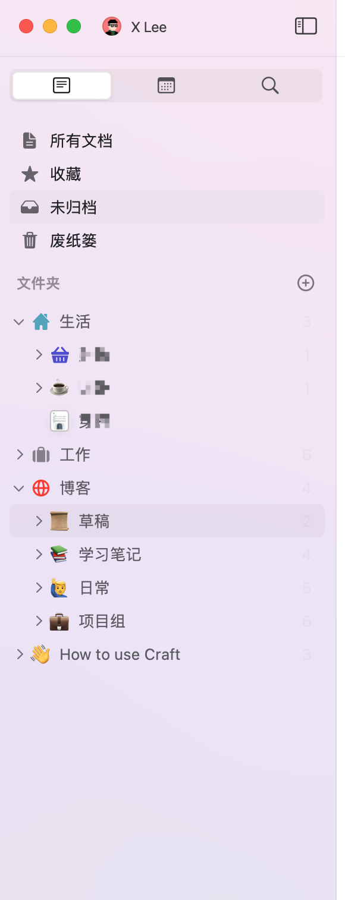

> 接续上文[笔记应用折腾1](https://leex0.top/posts/eb0ecd3d/)。
>
> 上次体验了一些常见的笔记应用，在各处都有不太满意的地方，最近有看了看别的应用，目前是找到了对我自己而言比较好用的应用。
>
> 这次的应用是[`Craft`](https://www.craft.do/)。

## 明确个人需求

> 与上一篇博客一样，这次贴出了主要需求。

1. `好看与稳定`。为了更优质的视觉效果，有时候甚至可以牺牲部分输入体验。
2. `博客编写（Hexo）`。需要定期输出博客内容，但博客内容需要单独保存且需要使用单独的模板，同时需要考虑博客中的照片存放。
3. `随笔记录`。在日常学习生活中可能会记录一些东西，不足以形成博客。
4. `文档库管理`。期望能将博客内容与随笔内容一起管理。
5. `分布存储`。属于某个项目的随笔，文件最好能存放在对应目录之下。~~（基本放弃，逻辑上集中与分布都讲得通)~~
6. `标签`。如果具有文档集中管理，通常具有便签功能。
7. `云同步`。能够在手机上查看文档库内容。MacOS与IOS都有客户端的话一般都有这个功能。对于个人使用没有也行。

## Craft

### 1. 功能模块

功能模块主要有两个，一个是文档库，一个是日历形式的每日笔记。

`文档库`

- 有预设的所有文档、收藏、未归档、废纸篓。
- 同时可以在下方文件夹组织自己的文档组织结构，在创建新文件夹时会默认让你选定一个文件夹对应的图标，种类不少可以自定义颜色还不错。

`每日笔记`

- 最上方为**日历📅**，可以快速定位当天位置，某日创建了笔记会在日历表中有小方框标注。
- 在下方可以在**对应日期快速创建每日笔记**，类似于在某天开了一篇日记，用法除了日记可以如对应某一日期的会议记录等。每日笔记独立于文档库，但可以把内容和文档库中相互引用。
- 在每日笔记中可以**创建待办事项**，会提示多少已完成和逾期。
- **可以同步Apple日历中的日程**，自动显示在对应日期的位置。

.png)

### 2. 笔记编写

Craft的书写体验很好，快捷键逻辑也算是比较清楚，同时对于默认的md语法支持的标注单调有了一定补充。

> ！！！可以选中文本或块后(未选中则默认当前Block)，通过输入`/`快速进行各种操作，插入内容，设置背景颜色，调整各种样式等等操作。配合[对块的操作快捷键](https://support.craft.do/hc/en-us/articles/360019555557-Keyboard-Shortcuts)，能快速优化排版。

#### 2.1 模块化

Craft中所有单元被设计为Block，操作不仅可以对具体的文本，同样可以针对单个或多个Block。例如对多个Block组织成卡片或者页面，装饰为焦点或者块等。这些部分在之后会有介绍。

可以在左侧至今进行单个的Block移动拖动复制等，也可以在页面左键框选多个Block统一操作。

#### 2.2 插入与样式

`插入`方面，支持插入文本、表格、文件、图片等等**，文件内容会统统上传至云端**。

`样式`方面，自带样式丰富，除了md语法支持的样式外：

1. 文本样式

.png)

- **团体**部分，可以将Block组织为`页面或卡片`，对于Craft而言，相当于在页面中添加了一个标签式的链接，可以进入作为二级页面打开。同时卡片有多种大小样式类型，方便文章排版。

.png)

- **对齐**部分，额外支持了`居中、左对齐、右对齐与缩进`。
- **装饰**部分，支持`焦点与块`。焦点即md中默认的quote块，而块指的是将几个block聚集在一起采用统一的样式管理。
- **颜色**部分，除了字体颜色标注外，每个Block与焦点或块都支持`背景颜色`。
- **字体**部分，可以选择内置的几种字体。

2. 图片样式

选中图片后，可以**对图片进行单独的样式调整**，图片尺寸，图片适应和排版。

3. 页面样式

页面样式主要为**基本页面信息**：标题设定，Block间距，页面宽度。

同时可以查看**页面信息**，创建时间，创建者，修改时间。

同样可以查看文件操作历史，与**回溯编辑版本**(这点还是挺方便的，应该是30天的记录)。

同时包括页面**统计信息**：字数，块数等等。

4. 链接引用

可以通过键入`@`或者`[[`来选择需要引用链接的文章或者部分。

#### 2.3 动作

动作主要包括对文档整体的操作，和对多个块的操作。查找、副本、移动等等。

#### 2.4 分享

这部分我认为Craft是做的比较好的。分享导出种类多，而且需要的配置选项都具有。

**分享主要通过私密链接、导出进行**。

`私密链接`即对文章生成一个Craft的链接，通过文章链接打开，可以选择开启对文章进行评论引用块等。类似于把文章发布与Craft的云端，获得了一个链接。

私密链接的文章保留了所有样式，包括作为二级内容的页面和卡片。可以作为直接发表的链接内容使用。

`导出部分`常用的是导出PDF、图像作为查看，导出Markdown作为编辑或移植。

导出含有图片的Markdown文件的话，**会将文件的md文件保存，另外有一个对应文件名的assert文件夹用以保存图片，并且正确引用图片链接**，很方便。（注：这种导出操作不在页面的导出的选项中，需要在文件库中右键文件名进行导出）

> 其中导出为Markdown可以选择，导出的类型，如Craft类型、Github类型等。
>
> 导出为Craft类型可以保留==符号的突出显示样式。
>
> 导出为Github类型兼容性更广。
>
> 导出时可以选择导出的具体样式如中标题尺寸，加粗水平线的样式等等。
>
> **此外，一些Craft自带的一些样式在导出Markdown时会自动删除，保留基础md语法样式，如页面、卡片、对齐、字体颜色、背景颜色等都会默认删除，焦点和块都会保留为`quote`。只是在Craft中会正常显示这些样式，这点从兼容性上讲非常方便。**

.png)

### 3. 其他

- 导入其他文件

这点非常友好，在文件夹界面，可以在右上角选定导入，导入可以是文件夹，会自动全部导入。

## 个人看法

> 上述主要是使用过程中的一些方法和技巧，下面说一下个人体验方面的问题。

1. 导入导出

因为之前有很多博客文件需要导入进去，所以需要进行大量的Markdown文件导入，最后能自动识别图片(基于普通的Markdown语法路径)和通过文件夹导入。显然Craft可以，这也是我能选择使用这个App的第一步。

导出的话，提供了比较多的易用导出。包括平时分享的话，会选择PDF或者图片或者私密链接。需要内容输出为博客的话就导出文件Markdown文本与图片，参见上述*2.4 分享*。

> 现在我已经不指望所有的文档管理都能完全管理已发布博文，还是在这边编写，导出再输出就OK。

2. 美观

没有主题设置，有对应的深色与浅色模式，排版和样式都还算不错。在用过的md文档编辑软件中也排得上前列。加上自带很多排版样式，这也是最吸引我的一点。

3. 跨平台

Apple产品都具有相应的客户端，Mac、iPhone、iPad都有App。同步不需要额外管，联网状态编辑完成稍等一下即会同步，速度还OK。

对我而言主要文本工作都会在Mac进行，移动应用对我而言主要是作为临时查看和发送共享，移动App都足够我使用。

> For Windows：
>
> 目前已经开始了Web App的bate测试，~~还没有体验过，后续体验了补充~~。
>
> 如果体验较好，可以跨平台编辑文档，Windows也可以临时用一下且同步了文件就挺好的。
>
> 补充：
>
> 目前已经体验了bate版的WebApp。体验还是比较优秀的，个人空间的内容全部得以保存，编辑功能与App端基本一致。Windows使用WebApp作为Mac之外的补充已经是非常好了。

4. 标签

没有标签，需要自己组织文件结构，对我而言还好，文件都有对应组织。

内容间能相互引用就可以了。

5. 价格

目前订阅制，45刀一年，~~学生可以申请免费使用。~~

> 更正：学生已经不能free了😢，只可以申请一个50%的discount。

6. 协作

应该是有比较好的协作体验，但这块功能我目前还没有使用过。

7. 缺点与问题

在Mac中使用，隔一段时间输入法会卡顿(搜狗)，需要重启Craft解决。

没有对文档生成目录，看起来不是很方便。

标题很难看出层次，经常忘了自己写的几级标题，需要点一下看到。

