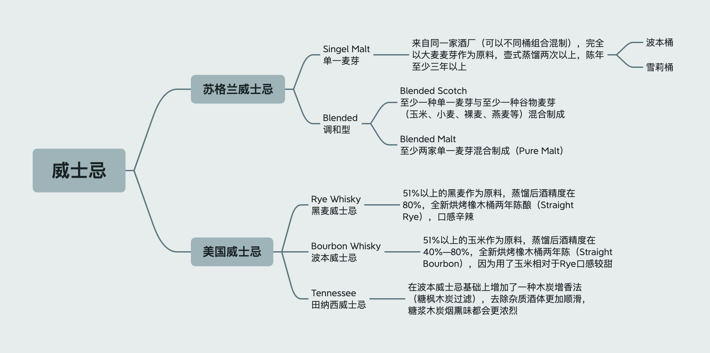

> 努力完成Whisky拼图
>
> 持续更新

## 调和威士忌

`Chivas`（芝华士）——木质感

`JohnnieWalker`——主打烟熏

`Ballantine's`（百龄坛）——轻烟熏

`Label5`——轻烟熏，麦芽含量30%较高

`Grant's`——酒精强烈，木质单宁重

`The Famous Grouse`（威雀）——糖糖的，木质单宁

`KAKU`（角牌）——清淡

## 单一麦芽

`The Glenlivet`（格兰威特）——波本，比较浅的琥珀色，经典的青草味道，青草和奶油味道作为主轴，后调带一些水果的味道 像是青苹果、凤梨，口味算是蛮清新

`Macallan`（麦卡伦）——雪莉，较深的琥珀色带一点棕红（这也是麦卡伦自己很标榜的the natural color自然酒色 不加焦糖色）

