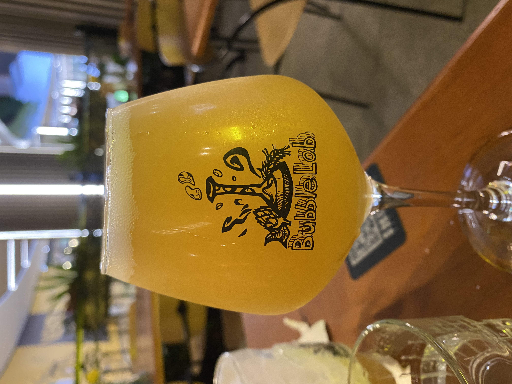
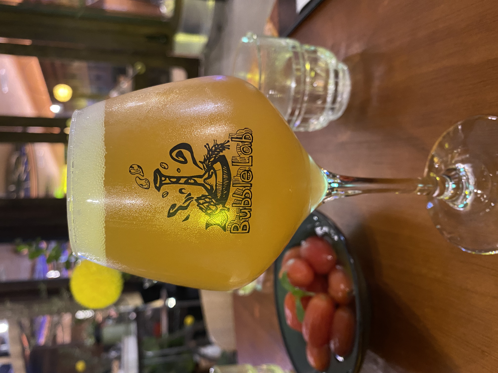
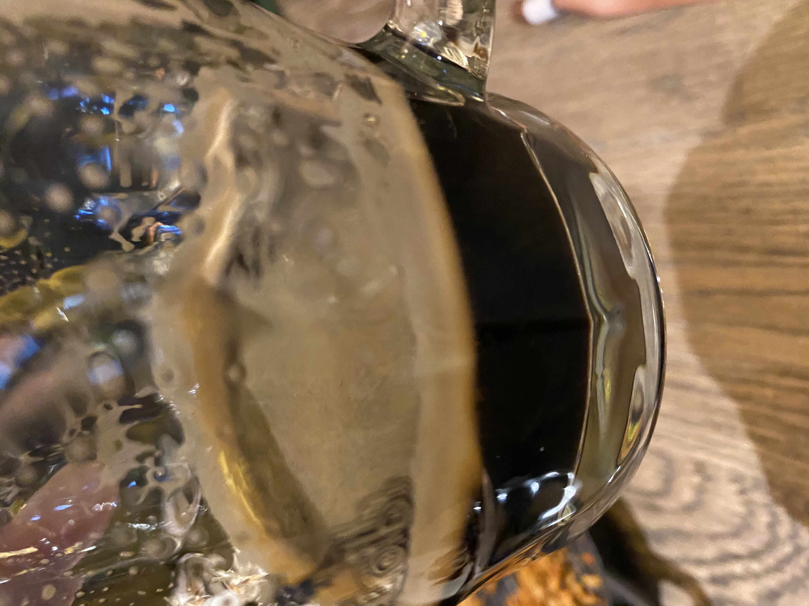

> 最近连着去了几次气泡实验室，喝了一些古斯。有的忘了拍照。

---

> 以下几款，先说结论，**很推荐很推荐`芭乐古斯`和`果汁风暴`。**喜欢不重口的世涛可以尝一下世涛。

### 气泡实验室 爪哇部落 [芭乐古斯](https://www.jiuhuar.com/craftbeer/5fb748d3526c607673e4e912.html)

就是因为这个酒去了不止一次气泡实验室。非常不错。

浓郁的果香，入口酸甜，酒感很弱，果味满满。酸甜平衡的很好。

同样十分适合女士喝。

### 气泡实验室 爪哇部落 [草莓古斯](https://www.jiuhuar.com/craftbeer/5f9dee81526c607673d92145.html)

没什么味道，草莓味也不算很大，而且感觉做出来不是很搭调。

还是几款柑橘浆果类的这种增味对啤酒而言更适合。

### 气泡实验室 爪哇部落 [凤梨古斯](https://www.jiuhuar.com/craftbeer/5fdac448790112110b7c10d8.html)

比较甜，有些酸，味道普普通通。

### 气泡实验室 爪哇部落 [魔法浆果黑加仑古斯](https://www.jiuhuar.com/craftbeer/6014fb23526c6076731e039c.html)

特别甜，一杯喝了半杯就甜的不想喝了。不太喜欢。

### 气泡实验室 爪哇部落 [绿里奇迹古斯](https://www.jiuhuar.com/craftbeer/60e7cc97790112168caafba1.html)

和凤梨古斯一样，有点酸甜普普通通。

### 气泡实验室 [果汁风暴 双倍新英格兰IPA](https://www.jiuhuar.com/craftbeer/603db8f17901124c0b489d93.html)

这款是喝过的气泡实验室的第一款酒。也比较不错。

酒体浑浊，薄厚适中。确实正如其名果汁风暴，拿到手里感觉是一杯香气馥郁的果汁。闻起来喝起来都像，但又不是明显的香精味道，有着大量热带水果的香气。

果味之外，也有酒花的苦味，但不很强烈。

此外，这款酒的度数有8度多，对于这个口感而言根本体会不到这个度数，所以应该容易喝这款喝醉。

还有一款气泡实验室 [及时雨](https://www.jiuhuar.com/craftbeer/5b3992fc8ba5b0902e8b4568.html) 新英格兰IPA，这个没有喝过，据了解是果汁风暴(juicy storm)的前身juicy rain。

### 气泡实验室 [气泡 IPA](https://www.jiuhuar.com/craftbeer/5b9f6f508ba5b04a2e8b4568.html)

普普通通IPA。

### 气泡实验室 [金色波特](https://www.jiuhuar.com/craftbeer/5b9f6d3c8ba5b0492e8b456a.html)

颜色相对于其他波特来说比较淡，淡淡的金色。

口味相对其他波特也挺淡的。透着淡淡的咖啡味。

### 气泡实验室 [香草帝国世涛](https://www.jiuhuar.com/craftbeer/5b9f73198ba5b0442e8b4569.html)

颜色重，酒体厚，除此之外也不是特别像世涛。

我喝起来一股花生酱🥜味。

### 牛啤堂 [帝都海盐](https://www.jiuhuar.com/craftbeer/5a7854da8ba5b0c30d8b4569.html) 古斯

主要是比较酸，稍微有一点点咸的回味。

整体而言就是酸，特别是第一口。之后就没那么酸，可以接受，但可能期望值比较高，没有喝出特别好的味道。

感觉很适合搭配油腻的东西佐餐，本身就比较清爽，同时又有酸味更加解腻。

### 牛啤堂 [芒果群](https://www.jiuhuar.com/craftbeer/60b62ed5526c60388fd787f4.html) 芒果海盐酸啤

口味非常light，没味道，硬要说就有一丝丝芒果🥭味道？不是很喜欢。

---

> 结尾粘一份芭乐古斯啤酒简介：
>
> 昏沉沉大太阳，使人放弃希望
>
> 空气在发烫，眼角留着晒伤
>
> 一个人踩着浪，已脱水的身体
>
> 汗水依然继续流淌，做着白日梦
>
> 脚步有些沉重，残留一身伤痛
>
> 心还留在Guava Tribe，太平洋的风让我有些醉
>
> 这游戏太过刺激，不想清醒，因为会痛
>
> 原谅我的吧啦吧啦，与我的不切实际，彻底告别
>
> 举起我的blahblah Gose，沉落在五光十色
>
> 去完成happy ending
>
> All love is in the room
>
> Gonna have the blahblah gose
>
> Ruling my Guava tribe
>
> 美好假期，在“爪哇部落”重置

