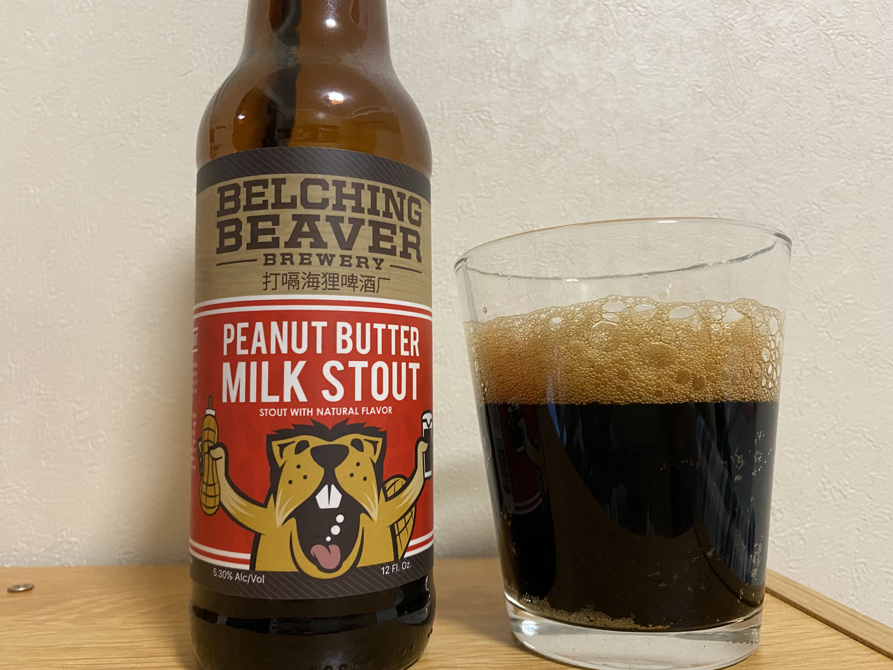
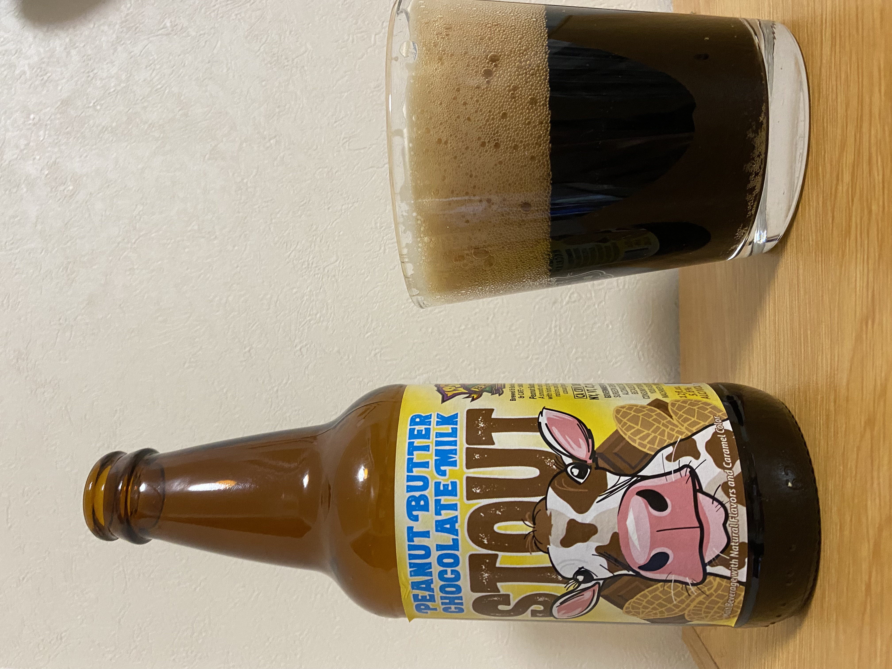

> 上次喝了一些古斯，又喝了一些酸啤，有的忘了记录，记一下手边还有的。还有一些超市爆款稍微记一下。

### 福禾 [勃艮第女公爵](https://www.jiuhuar.com/craftbeer/5b31ec828ba5b02f078b456a.html)

**非常的酸**，开瓶还醒了几分钟，喝起来像喝果醋带点气泡。

可能酸啤之前喝的不太多，这瓶主要就感觉酸了。

应该会再喝喝看。

啤酒的尽头果然是醋和酱油吗。

### 圣伯纳 12号 [修道院四料](https://www.jiuhuar.com/craftbeer/56e13dad8b15e6e6e1d46754.html)

因为在哪看的说这个和W12有点像所以买了。W12没喝过但是感觉这个不太行。

没有什么厚重的感觉，还不如罗10。

---

### 打嗝海狸 [花生酱牛奶世涛](https://www.jiuhuar.com/craftbeer/5b7a29cc8ba5b0c14b8b4569.html)

闻起来很香，闻着就符合名字花生酱牛奶世涛。

不知道是不是批次的原因，这次喝倒出来也基本没什么泡沫，喝起来也没有一点点沙口感。感觉有点奇怪，让口感像别的饮料不像啤酒。

甜口的，也挺香，咖啡巧克力蛋糕之类的香甜，所以感觉负担很大😂。

有机会再喝喝，自己这次买的口感有些一般。

### 迷失海岸 [花生酱巧克力牛奶世涛](https://www.jiuhuar.com/craftbeer/5c78ae7c7901124eb2067bf0.html)

味道淡，不算很厚的口感，有一点巧克力蛋糕的味道，不知道为什么闻香有点点香皂的味道。

相对还是打嗝海狸的花生酱牛奶世涛好些。

