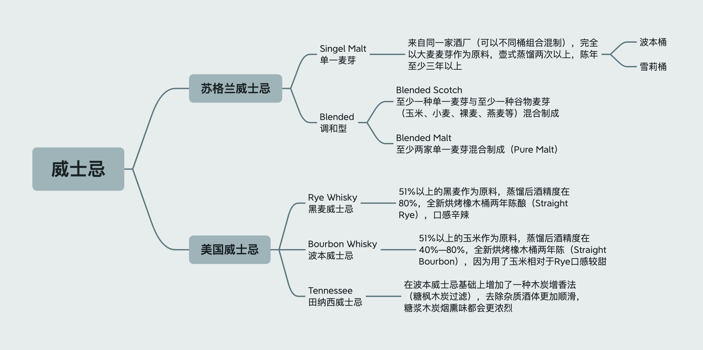

> 努力完成威士忌拼图
>
> 持续更新（最新更新2021-10-28）
>
> 2021-10-28
>
> 2021-06-21

## 单一麦芽

`The Glenlivet`格兰威特

- [x] 格兰威特12年

  波本桶，比较浅的琥珀色，经典的青草味道，青草和奶油味道作为主轴，后调带一些水果的味道 像是青苹果、凤梨，口味算是蛮清新

`Macallan`麦卡伦

- [x] 麦卡伦蓝钻12年双桶

  雪莉，口味丰富，果香爆炸，较深的琥珀色带一点棕红（这也是麦卡伦自己很标榜的the natural color自然酒色 不加焦糖色）

`The Singleton`苏格登

- [x] 苏格登12年GLEN ORD

  口味一般，别的忘了

`Clynelish`克里尼利基

- [x] 小猫14

  入口柔顺，太妃糖巧克力香甜，尾韵略辛辣，口感比较醇厚（不知道是不是所谓的蜡质感）

`The Balvenie`百富

- [x] 百富12年双桶陈酿

  香甜，口味均衡，有果香，尾韵一点烟熏，盒子瓶子好看

## 调和威士忌

`JohnnieWalker`

- [x] 红方 RED LABEL

  烟熏

- [x] 黑方 BLACK LABEL

  烟熏

- [x] DOUBLE BLACK

  很重的烟熏

`Grant's`

- [x] 红标三桶

  酒精强烈，木质单宁重

`The Famous Grouse`威雀

- [x] 威雀基础款

  酒精味较重，有些冲，木质感较重，便宜

`KAKU`（角牌）

- [x] 三得利角牌

`Chivas`芝华士——木质感

`Ballantine's`百龄坛——轻烟熏

`Label5`——轻烟熏，麦芽含量30%较高

## 波本

`Jim Beam`金宾/占边

- [x] 白金宾

  口味香甜，典型的波本味道，便宜大碗
