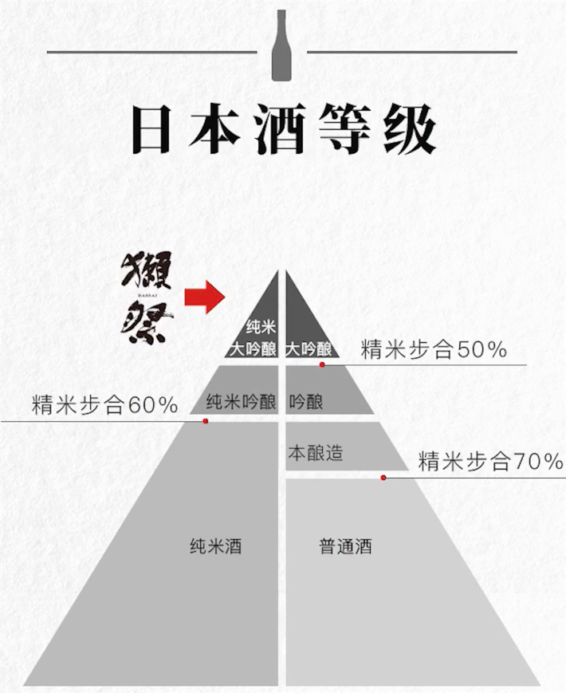
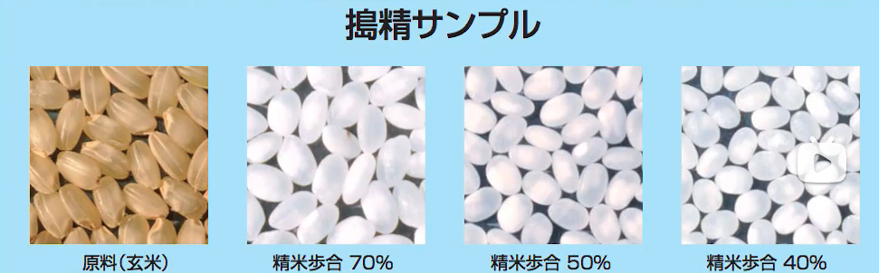

## 1. 纯米酒系与本酿造酒系

如果清酒的原料只用到**水、米、米曲**，那麽它就属于`纯米酒系`。

但如果除了这几样原料之外，还额外添加了cate，那麽它就是`本酿造酒系`。 

此外，还可以通过精米步合程度对纯米酒系和本酿造酒系进行进一步的细分。通常纯米酒系的口感比较温和、充满了稻米的鲜味，而本酿造酒系因为添加了酿造酒精的关係，使它的口感变得比较辛辣，很适合搭配料理。

## 2. 精米步合

`精米步合`指的是把**米外层磨掉了多少，只保留米心**。

精米步合45%即只保留45%的米心，磨去55%外层。

> 举例獭祭产品线
>
> 獭祭45：精米步合45%
>
> 三割九分：精米步合39%
>
> 二割三分：精米步合23%
>
> 磨之先驱：精米步合很高就是了

## 3. 酒度

日本**酒度跟酒精度并没有半点关系**！

`酒度`一般是用来衡量口感的甜度值的，负值越低，说明越甜，喝起来比较甘口；正值越高，说明口感偏顺畅，喝起来会有点微辣。

而虽然日本酒度可作为口感甜度的判断标准，但口味的甜度也会受到其他因素的影响，因此也不能一概而论。

## 4. 酸度

`酸度`是用来表示**清酒浓淡的数值**,并不是用来表示酸味的轻重的。数值越高，口感会比较浓郁；数值越低，口感则会比较清淡。

### 一合

一合酒是多少：A quarter即**180ml**

---

> 参考：
>
> https://everylittled.com/article/108942
