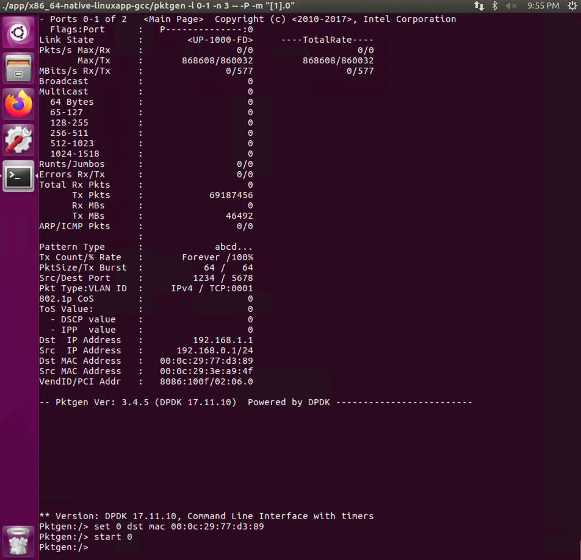

> 配置信息：
>
> VMware® Workstation 16 Pro: 16.1.1 build-17801498
>
> Ubuntu-16.04.6: Linux ubuntu 4.15.0-142-generic
>
> CPU: 2个处理器，每个处理器2个内核
>
> 内存: 4GB
>
> 网卡: 网络适配器-NAT(ens33)，网络适配器2-Host-only(ens38)，网络适配器3-Host-only(ens39)
>
> [DPDK](http://core.dpdk.org/download/): DPDK-17.11.10(LTS)
>
> [Pktgen](https://git.dpdk.org/apps/pktgen-dpdk/refs/tags): pktgen-3.4.5
>
> 
>
> PS：安装使用Pktgen前，需要将DPDK安装配置完成，可参考[链接](https://leex0.top/posts/7214eebe/)。

## 1. 下载解压编译

```bash
wget https://git.dpdk.org/apps/pktgen-dpdk/snapshot/pktgen-dpdk-pktgen-3.4.5.tar.gz
tar -xvJf pktgen-dpdk-pktgen-3.4.5.tar.gz
cd pktgen-dpdk-pktgen-3.4.5
make
```

## 2. 网卡互打测试

测试在同一虚拟机中一网卡发送另一网卡接收

```bash
# TEST pktgen
# 必须在Pktgen的根目录下运行
# -l：使用核心列表 -n：指定内存通道 -- -P：开启网卡混杂模式 -m：端口映射
# "[1].0, [2].1"：核心1映射到port0，核心2映射到port1
./app/build/pktgen -l 0-2 -n 3 -- -P -m "[1].0, [2].1"
```

限制接受网卡速率后的`Pktgen`发送速率如下（千兆网卡）


## 3. 双虚拟机：`Pktgen`发送到`testpmd`

`Ptkgen`端网卡mac为**00:0c:29:3e:a9:4f**，`testpmd`端网卡mac为**00:0c:29:77:d3:89**

```bash
# RUN pktgen
# pktgen:/> set 0 dst ip 192.168.74.132
# IP设定没有用,通过mac发送
./app/x86_64-native-linuxapp-gcc/pktgen -l 0-1 -n 3 -- -P -m "[1].0"
pktgen:/> set 0 dst mac 00:0c:29:77:d3:89

# RUN testpmd
# -l：使用核心列表 -n：指定内存通道 -- -i:交互模式
./testpmd -l 0-1 -n 1 -- -i
# 设置只读
testpmd> set fwd rxonly
# 设置非混杂模式(这两项设定这样就只收pktgen发来的包)
testpmd> set promisc all off
# 运行开始
testpmd> start
# 查看接收状态
testpmd> show port stats all	
```

### 3.1 `Pktgen`设定1000个包发送

```bash
pktgen:/> set 0 count 1000
pktgen:/> start 0
```

`Pktgen`端发送状况


`testpmd`端接收状况，，可以看到`port 0`比`port 1`多接收了**1000**个包(测试了100个包基础上)。


### 3.2 `Pktgen`设定10000个包发送

```bash
pktgen:/> set 0 count 10000
pktgen:/> start 0
```

`testpmd`端接收状况，可以看到`port 0`比`port 1`多接收了**10000**个包(上一轮测试基础上)。


### 3.3 不限制包数目发送

```bash
pktgen:/> start 0
```

 `Pktgen`端发送状况



`testpmd`端接收状况


---

### 疑问

0. **情形一**：两个虚拟机的两个虚拟网卡一个发送一个接收；**情形二**：一个虚拟机中两个虚拟网卡一个发送一个接收

1. 千兆网卡的速率上限由何决定？为什么情形一和情形二，既不是两个满带宽，也不是两个对半分带宽。
2. 情形一和情形二为何带宽速率一样？

---

> 参考：
>
> https://www.jianshu.com/p/fa7d9f2c0f55
>
> https://pktgen-dpdk.readthedocs.io/en/latest/getting_started.html
>
> https://zhuanlan.zhihu.com/p/154066913
