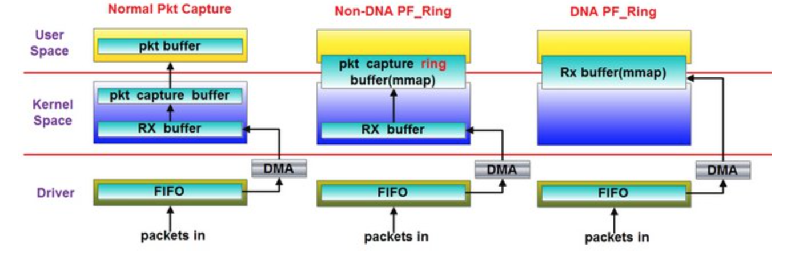

## 1. PF_RING介绍

[PF_RING](https://github.com/ntop/PF_RING)是[ntop公司](https://www.ntop.org/)开发的高性能数据包捕获套接字。

使用下图来说明其与传统数据包捕获不同：



在数据到达网卡时，首先将数据从网卡拷贝到`RX buffer`，这个过程使用了`DMA`（Direct Memory Access），CPU初始化`DMA`，实际的拷贝过程由`DMA`控制器完成，不消耗CPU资源，所以在此不算做一次拷贝。在接下来的过程中：

1. **传统数据包捕获**：在内核空间中将数据从`RX buffer`拷贝到`pkt capture buffer`中**（1次拷贝）**，之后为了用户使用还需要从内核空间的`pkt capture buffer`中将数据拷贝至用户空间的`pkt buffer`**（2次拷贝）**。
2. **PF_RING**：将数据从`RX buffer`拷贝到`ring buffer`中**（1次拷贝）**，通过`mmap`映射到用户空间，直接由用户应用使用。
3. **PF_RING ZC（zero copy）**：在数据到达`RX buffer`直接通过`mmap`映射给用户应用使用，没有拷贝过程称为zero copy，速度最快，使用收费。

## 2. 安装

> 配置信息：
>
> VMware® Workstation 16 Pro: 16.1.1 build-17801498
>
> Ubuntu-16.04.6: Linux ubuntu 4.15.0-142-generic
>
> 网卡: 网络适配器-NAT(ens33)，网络适配器2-Host-only(ens38)
>
> PF_RING: 7.8.0
>
> Suricata: 6.0.3

### 2.1 安装`PF_RING` 与 支持`PF_RING`的`Suricata`

```bash
## Recommended dependency
apt-get install libpcre3 libpcre3-dbg libpcre3-dev build-essential libpcap-dev   \
                libnet1-dev libyaml-0-2 libyaml-dev pkg-config zlib1g zlib1g-dev \
                libcap-ng-dev libcap-ng0 make libmagic-dev         \
                libgeoip-dev liblua5.1-dev libhiredis-dev libevent-dev \
                python-yaml rustc cargo libjansson-dev bison flex \
                libnspr4-dev libnss3-dev libmaxminddb-dev

## Install PF_RING
git clone https://github.com/ntop/PF_RING.git
cd PF_RING/kernel
make && sudo make install

cd PF_RING/userland/lib
./configure && make && sudo make install

## Install Suricata
git clone https://github.com/OISF/suricata
cd suricata

# Latest Suricata contains libhtp
# git clone https://github.com/OISF/libhtp
# ./autogen.sh

# add PF_RING support
LIBS="-lrt" ./configure --prefix=/usr --sysconfdir=/etc --localstatedir=/var \
  --enable-pfring --with-libpfring-includes=/usr/local/include \
  --with-libpfring-libraries=/usr/local/lib

make
sudo make install
sudo ldconfig

# Running 'make install-conf' will install initial configuration files to /etc/suricata/. 
# Running 'make install-rules' will fetch and load rules.
sudo make install-conf
sudo make install-rules
# You can run 'make install-full' if you want to install configuration and rules and provide you a ready-to-run suricata.

## Verify
suricata --build-info | grep PF_RING
PF_RING support:                         yes

## Some wrong happened in Ubuntu16.04.6
[ERROR] make[1]: bison: Command not found
[Solved] apt install bison
[ERROR] make[1]: lex: Command not found
[Solved] apt install flex
[ERROR] ./configure
[Solved] apt install libjansson-dev libnspr4-dev libnss3-dev libmaxminddb-dev
```

### 2.2 检查安装信息

```bash
$ suricata --build-info    
This is Suricata version 6.0.3 RELEASE
Features: PCAP_SET_BUFF PF_RING AF_PACKET HAVE_PACKET_FANOUT LIBCAP_NG LIBNET1.1 HAVE_HTP_URI_NORMALIZE_HOOK PCRE_JIT HAVE_LIBJANSSON TLS TLS_C11 MAGIC RUST 
SIMD support: SSE_4_2 SSE_4_1 SSE_3 
Atomic intrinsics: 1 2 4 8 16 byte(s)
64-bits, Little-endian architecture
GCC version 5.4.0 20160609, C version 201112
compiled with _FORTIFY_SOURCE=2
L1 cache line size (CLS)=64
thread local storage method: _Thread_local
compiled with LibHTP v0.5.38, linked against LibHTP v0.5.38

Suricata Configuration:
  AF_PACKET support:                       yes
  eBPF support:                            no
  XDP support:                             no
  PF_RING support:                         yes
  NFQueue support:                         no
  NFLOG support:                           no
  IPFW support:                            no
  Netmap support:                          no 
  DAG enabled:                             no
  Napatech enabled:                        no
  WinDivert enabled:                       no

  Unix socket enabled:                     yes
  Detection enabled:                       yes

  Libmagic support:                        yes
  libnss support:                          no
  libnspr support:                         no
  libjansson support:                      yes
  hiredis support:                         no
  hiredis async with libevent:             no
  Prelude support:                         no
  PCRE jit:                                yes
  LUA support:                             no
  libluajit:                               no
  GeoIP2 support:                          no
  Non-bundled htp:                         no
  Hyperscan support:                       no
  Libnet support:                          yes
  liblz4 support:                          no
  HTTP2 decompression:                     no

  Rust support:                            yes
  Rust strict mode:                        no
  Rust compiler path:                      /usr/bin/rustc
  Rust compiler version:                   rustc 1.47.0
  Cargo path:                              /usr/bin/cargo
  Cargo version:                           cargo 1.46.0
  Cargo vendor:                            yes

  Python support:                          yes
  Python path:                             /usr/bin/python3
  Python distutils                         yes
  Python yaml                              yes
  Install suricatactl:                     yes
  Install suricatasc:                      yes
  Install suricata-update:                 yes

  Profiling enabled:                       no
  Profiling locks enabled:                 no

  Plugin support (experimental):           yes

Development settings:
  Coccinelle / spatch:                     no
  Unit tests enabled:                      no
  Debug output enabled:                    no
  Debug validation enabled:                no

Generic build parameters:
  Installation prefix:                     /usr
  Configuration directory:                 /etc/suricata/
  Log directory:                           /var/log/suricata/

  --prefix                                 /usr
  --sysconfdir                             /etc
  --localstatedir                          /var
  --datarootdir                            /usr/share

  Host:                                    x86_64-pc-linux-gnu
  Compiler:                                gcc (exec name) / g++ (real)
  GCC Protect enabled:                     no
  GCC march native enabled:                yes
  GCC Profile enabled:                     no
  Position Independent Executable enabled: no
  CFLAGS                                   -g -O2 -std=c11 -march=native -I${srcdir}/../rust/gen -I${srcdir}/../rust/dist
  PCAP_CFLAGS                               -I/usr/include
  SECCFLAGS   
```

在`Line3`与`Line17`中可看到：

Features: PCAP_SET_BUFF **PF_RING** AF_PACKET HAVE_PACKET_FANOUT LIBCAP_NG LIBNET1.1 HAVE_HTP_URI_NORMALIZE_HOOK PCRE_JIT HAVE_LIBJANSSON TLS TLS_C11 MAGIC RUSTSIMD support: SSE_4_2 SSE_4_1 SSE_3

**PF_RING support:                         yes**

## 3. 测试

### 3.1 测试基础信息

```bash
## 流量发送
此次我使用的Pktgen对于ens38网卡的mac地址进行了流量发送。

## 装载 PF_RING
modprobe pf_ring
modinfo pf_ring && cat /proc/net/pf_ring/info

## 当有一个 PF_RING 进程启动，会在 /proc/net/pf_ring/ 下多出一个描述文件。
## 随着 PF_RING 结束，描述文件会消失。文件名不固定，可以查看当前 PF_RING 信息。
cat /proc/net/pf_ring/6371-ens38.6

## kill suricata
kill -9 $(pidof suricata) && rm -f /var/run/suricata.pid
```

### 3.2 测试 `PF_RING`

```bash
cd PF_RING/userland
make && make install
./examples/pfcount -i ens38

# 发送的流量可以在输出信息中查看到
···
=========================
Absolute Stats: [5'194'609 pkts total][0 pkts dropped][0.0% dropped]
[5'194'609 pkts rcvd][3'647'046'644 bytes rcvd][120'761.76 pkt/sec][678.28 Mbit/sec]
=========================
Actual Stats: [160'765 pkts rcvd][1'000.15 ms][160'740.72 pps][0.90 Gbps]
=========================

^CLeaving...
=========================
Absolute Stats: [5'238'395 pkts total][0 pkts dropped][0.0% dropped]
[5'238'395 pkts rcvd][3'677'823'624 bytes rcvd][121'030.98 pkt/sec][679.80 Mbit/sec]
=========================
Actual Stats: [43'786 pkts rcvd][266.09 ms][164'552.72 pps][0.93 Gbps]
=========================

# 同时可在 /proc/net/pf_ring/6371-ens38.6 中看到流量
···
Tot Packets            : ****
Tot Pkt Lost           : 0
Tot Insert             : 60
Tot Read               : 60
Insert Offset          : 8448
Remove Offset          : 8448
Num Free Slots         : 4098
···
```

### 3.3 测试带有`PF_RING`的`Suricata`

```bash
suricata --pfring-int=ens38 --pfring-cluster-id=99 --pfring-cluster-type=cluster_flow -c /etc/suricata/suricata.yaml
tail -f /var/log/suricata/fast.log

# 发送的流量处理信息可以在 fast.log 中查看到
···
08/05/2021-00:24:58.682951  [**] [1:2210023:2] SURICATA STREAM ESTABLISHED SYNACK resend with different ACK [**] [Classification: Generic Protocol Command Decode] [Priority: 3] {TCP} 104.18.10.234:443 -> 10.12.170.93:62637
08/05/2021-00:24:58.683493  [**] [1:2210026:2] SURICATA STREAM ESTABLISHED SYN resend [**] [Classification: Generic Protocol Command Decode] [Priority: 3] {TCP} 10.12.170.93:62632 -> 172.65.253.13:443
08/05/2021-00:24:58.683494  [**] [1:2210023:2] SURICATA STREAM ESTABLISHED SYNACK resend with different ACK [**] [Classification: Generic Protocol Command Decode] [Priority: 3] {TCP} 172.65.253.13:443 -> 10.12.170.93:62632

# 同时可在 /proc/net/pf_ring/6371-ens38.6 中看到流量
```

## 附1：PF_RING ZC[驱动支持设备](https://github.com/ntop/PF_RING/tree/dev/drivers/intel)

```
# PF_RING/drivers/intel/README

Available PF_RING ZC Intel drivers:

e1000e (1 Gbit - PCI Express-only) 8254x/8256x/8257x/8258x
igb (1 Gbit) 82575/82576/82580/I350/I210
ixgbe (10 Gbit) 82599/X520/X540 
i40e (10/40 Gbit) X710
fm10k (10/40/100 Gbit) FM10000
```

> 注：
>
> 最终项目未采用具有PF_RING特性的Suricata，因为[使用PF_RING不能将Suricata配置为IPS模式](https://forum.suricata.io/t/suricata-pf-ring-in-ips-mode/469)。
>
> 在项目中IPS为硬性需求，故为采用。

---

> 参考：
>
> ntop官方提供兼容Suricata文档：https://www.ntop.org/guides/pf_ring/thirdparty/suricata.html
>
> Suricata文档：https://suricata.readthedocs.io/en/suricata-6.0.3/
>
> PF_RING学习：https://www.jianshu.com/p/6d3f3cdc2411
>
> Suricata-PF_RING安装参考：https://blog.csdn.net/qq_31507523/article/details/110092228
