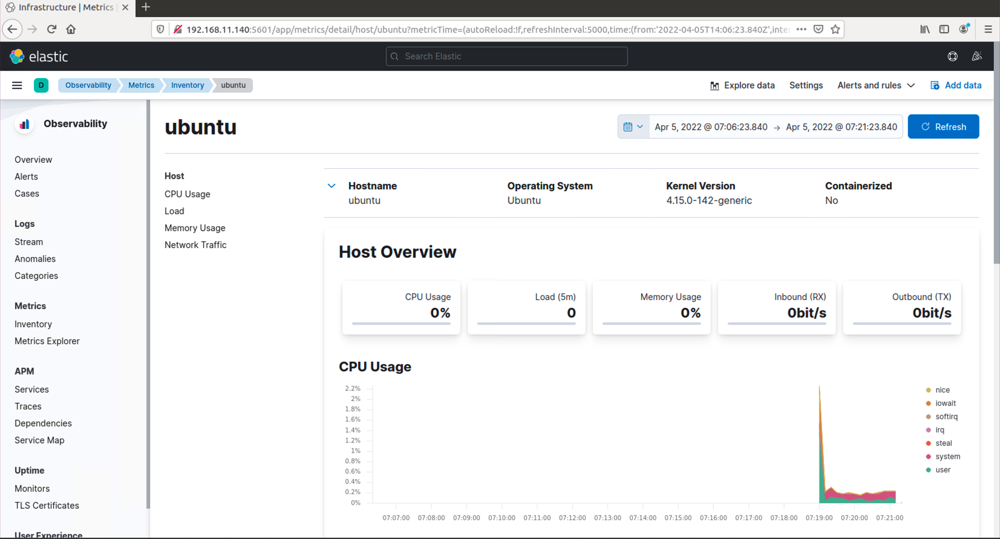

# 1. [Elasticsearch](Download Elasticsearch https://www.elastic.co/cn/downloads/elasticsearch)

> `Elasticsearch`是一个开源的高扩展的分布式全文检索引擎，它可以近乎实时的存储、检索数据；本身扩展性很好，可以扩展到上百台服务器，处理PB级别的数据。
>
> `Elasticsearch`也使用Java开发并使用`Lucene`作为其核心来实现所有索引和搜索的功能，但是它的目的是通过简单的RESTful API来隐藏Lucene的复杂性，从而让全文搜索变得简单。

### 1.1 部署

测试环境

```Bash
Linux ubuntu 4.15.0-142-generic #146~16.04.1-Ubuntu SMP Tue Apr 13 09:27:15 UTC 2021 x86_64 x86_64 x86_64 GNU/Linux

### 网络信息 ###
inet addr:192.168.11.140  Bcast:192.168.11.255  Mask:255.255.255.0
```

下载`Elasticsearch`

```Bash
### 部署依赖Java环境 ### 
apt-get install openjdk-8-jdk
java -version


wget https://artifacts.elastic.co/downloads/elasticsearch/elasticsearch-8.1.2-linux-x86_64.tar.gz

tar -zxvf elasticsearch-8.1.2-linux-x86_64.tar.gz
cd elasticsearch-8.1.2
```

修改配置文件

```Bash
### 设置 Elasticsearch 所在 host 地址 ###
# By default Elasticsearch is only accessible on localhost. Set a different
# address here to expose this node on the network:
network.host: 192.168.11.140


### 默认端口为9200可根据需求设置 ###
#http.port: 9200


### 不需要的话可以关闭安全设置 ###
# Enable security features
xpack.security.enabled: false
xpack.security.enrollment.enabled: false
```

启动`Elasticsearch`

```Bash
### 前台启动 ###
./bin/elasticsearch

### 后台启动 ###
nohup ./bin/elasticsearch &

### 查看进程 ###
ps -ef | grep elasticsearch
```

启动成功后可访问端口获得信息

```Bash
> elasticsearch-8.1.2 curl 192.168.11.140:9200

{
  "name" : "ubuntu",
  "cluster_name" : "elasticsearch",
  "cluster_uuid" : "1Xe_ptwRQc-NXTS4D8gxSQ",
  "version" : {
    "number" : "8.1.2",
    "build_flavor" : "default",
    "build_type" : "tar",
    "build_hash" : "31df9689e80bad366ac20176aa7f2371ea5eb4c1",
    "build_date" : "2022-03-29T21:18:59.991429448Z",
    "build_snapshot" : false,
    "lucene_version" : "9.0.0",
    "minimum_wire_compatibility_version" : "7.17.0",
    "minimum_index_compatibility_version" : "7.0.0"
  },
  "tagline" : "You Know, for Search"
}
```

### 1.2 部署问题

- #### 最大虚拟内存不足

```Bash
// 将虚拟内存大小设置为更大值

sysctl -w vm.max_map_count=262144
```

- #### `root`用户

`Elasticsearch`是不允许使用`root`用户启动的，所以我们需要添加用户启动。

```Bash
adduser es
passwd es
chown -R es:es  ~/elasticsearch-8.1.2
```

# 2. Kibana

> `Kibana`是一个开源的分析与可视化平台，设计出来用于和`Elasticsearch`一起使用的。你可以用`Kibana`搜索、查看、交互存放在`Elasticsearch`索引里的数据，使用各种不同的图表、表格、地图等`Kibana`能够很轻易地展示高级数据分析与可视化。

### 部署

下载`Kibana`

```Bash
wget https://artifacts.elastic.co/downloads/kibana/kibana-8.1.2-linux-x86_64.tar.gz

tar -zxvf kibana-8.1.2-linux-x86_64.tar.gz
cd kibana-8.1.2/
```

修改配置文件

```Bash
### Kibana服务host ###
server.host: "192.168.11.140"

### 默认port 5601 ###
#server.port: 5601

### 指定elasticsearch.hosts ###
elasticsearch.hosts: ["http://192.168.11.140:9200"]
```

启动`Kibana`

```Bash
### 前台启动 ###
./bin/kibana

### 后台启动 ###
nohup ./bin/kibana &

### 停止 ###
# ps -ef | grep 5601 找不到kibana服务
fuser -n tcp 5601
kill -p pid
```

# 3. Metricbeat

> Metricbeat可以定期收集操作系统和服务器的运行指标（CPU，内存，硬盘，IO,读写速度，进程等等），Metricbeat可以将收集到的指标和数据发送到你指定的输出，比如：elasticsearch，最终达成监视服务器的目标。

### 部署

下载`Metricbeat`

```Bash
wget https://artifacts.elastic.co/downloads/beats/metricbeat/metricbeat-8.1.2-linux-x86_64.tar.gz

tar -xvf metricbeat-8.1.2-linux-x86_64.tar.gz
cd metricbeat-8.1.2-linux-x86_64
```

修改配置文件

```Bash
### 设置kibana地址 ###
setup.kibana:

  # Kibana Host
  # Scheme and port can be left out and will be set to the default (http and 5601)
  # In case you specify and additional path, the scheme is required: http://localhost:5601/path
  # IPv6 addresses should always be defined as: https://[2001:db8::1]:5601
  host: "192.168.11.140:5601"

### 设置Elasticsearch地址 ###
# ---------------------------- Elasticsearch Output ----------------------------
output.elasticsearch:
  # Array of hosts to connect to.
  hosts: ["192.168.11.140:9200"]

### 设置Dashboards启动 ###
# ================================= Dashboards =================================
# These settings control loading the sample dashboards to the Kibana index. Loading
# the dashboards is disabled by default and can be enabled either by setting the
# options here or by using the `setup` command.
setup.dashboards.enabled: true
```

启动`Metricbeat`

```Bash
./metricbeat -e
```

# 4. 效果截图

> 上述仅做了ELK Stack的最简单配置与使用，下图为相关展示。



.png)

下图为启动`Dashboards`才可分析展示：

.png)

.png)

.png)

