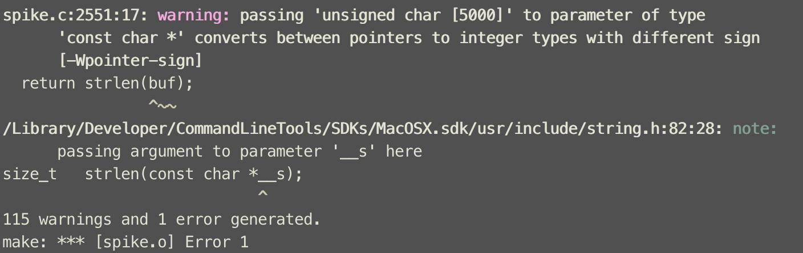

> 之前了解了一下Spike模糊测试框架，本文记录一下使用过程中遇到的问题与使用测试结果。


## 1. 编译问题

### macos编译

使用macos编译出现一些问题，未再考虑。



### centos编译

centos编译结果正常，但是运行过程中显示一个库文件`libdlrpc.so`引用失败。如图：


根据查找，运行`src`下`ld.sh`脚本导入环境变量解决。

注：通过`source ld.sh`或`. ./ld.sh`运行，通过`./ld.sh`则无法解决。原因参见[此文章](https://leex0.top/2020/08/11/shell%E8%84%9A%E6%9C%AC%E8%AE%BE%E7%BD%AE%E7%8E%AF%E5%A2%83%E5%8F%98%E9%87%8F%E9%97%AE%E9%A2%98/)。

`ld.sh`如下：

```bash
#Use this to use any of the generic programs
#try using . ./ld.sh if it's not working
export LD_LIBRARY_PATH=.
```

## 2. vulnserver程序测试

通过使用vulnserver，测试spike能否正确使用。

脚本如下：

```c
s_readline();
s_string("TRUN");
s_string_variable("COMMAND");
```

攻击端（CentOS）`./generic_send_tcp 10.xx.xx.xx 9999 vul_test.spk 0 0`：


服务器端（WindowsXP）程序崩溃：


## 3. flask web测试

搭建一个简单的web服务器(`python flask`)测试spike使用。

攻击脚本如下：

```c
s_string("GET / HTTP/1.1\r\n");
s_string("Host: 10.37.129.5:5000\r\n");
s_string("User-Agent: ");
s_string("Content-Length: ");
s_blocksize_string("block1", 5); 
s_string("\r\nConnection: close\r\n\r\n");
s_block_start("block1");
s_string("inputvar=");
s_block_end("block1");
```

攻击端（CentOS）`./generic_send_tcp 10.37.129.5 5000 flask.spk 0 0`：


服务器端（Ubuntu）：

