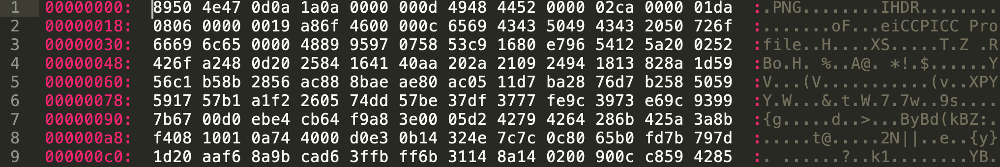

## 1. 内容介绍

### 1.1 模糊测试简介

模糊测试（Fuzzing），是一种通过向目标系统提供非预期的输入并监视异常结果来发现软件漏洞的方法。
其核心思想是自动或半自动的生成随机数据输入到一个程序中，并监控目标程序异常，如崩溃，断言(assertion)失败，以发现可能的程序错误，比如内存泄漏等。
即用随机坏数据（也称做 fuzz）攻击一个程序，然后等着观察哪里遭到了破坏。但这一过程却能揭示出程序中的重要 bug。
它是一种介于完全的手工渗透测试与完全的自动化测试之间的安全性测试类型。它充分利用了机器能够随机生成和发送数据的能力。

### 1.2 Spike框架

Spike是一个模糊器创建工具包，它提供了API，允许用户基于网络的协议来创建自己的fuzzer。其中包含一些通用的模糊测试器。

### 1.3 网络协议模糊测试

对网络协议进行模糊测试也需要识别出可被攻击的接口，通过变异或生成方式得到能够触发错误的模糊测试值，然后将这些模糊测试值发送给目标应用，监视目标应用的错误。

## 2. 基本过程

* 确定测试的目标
* 确定输入的向量
* 生成模糊测试数据，可由测试工具通过随机或是半随机的方式生成
* 执行模糊数据测试
* 监视异常
* 判定发现的漏洞是否可能被利用

## 3. 测试方法分类

* 基于`变异`的模糊测试——简而言之就是正常调用协议，抓包，然后混淆数据包达到生成异常数据包的结果，从而进行测试。

> 这种方法对已有的正常数据集依赖较高。需要有足够丰富的合法输入从而产生足够丰富的测试类型。

例如，png图片除了文件头后面数据内容进行置换混淆得到异常测试数据。

* 基于`生成`的模糊测试——简而言之就是理解协议规约定义，创建文法自动生成动态模糊的测试用例。

> 这种方法对协议的理解掌握程度需求更高。难度更大。

## 4. 困难点

协议分析，对于特定的程序与配套协议，需要对程序段进行逆向分析才能得到
协议内容以创建测试样例，而其中逆向分析工作难度与工作量都较大。